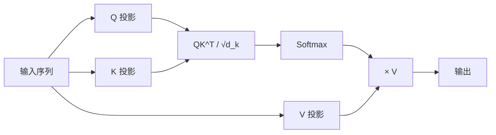

## 注意力机制

注意力机制让模型在处理每个词时能"看到"整个序列。



### 直观理解

翻译句子："**The animal didn't cross the street because it was too tired**"

"it" 指的是什么？人类知道是 "animal"。注意力机制让模型也能学会这种关联——计算 "it" 和句中每个词的关联程度。

### 数学定义

缩放点积注意力（Scaled Dot-Product Attention）：

$$
\text{Attention}(Q, K, V) = \text{softmax}\left(\frac{QK^T}{\sqrt{d_k}}\right)V
$$

三个矩阵：
- $Q$（Query）：查询，当前词想知道什么
- $K$（Key）：键，其他词能提供什么信息
- $V$（Value）：值，其他词的实际内容

### 计算步骤

1. 计算 $Q$ 和 $K$ 的点积，得到注意力分数
2. 除以 $\sqrt{d_k}$ 防止梯度消失
3. Softmax 归一化为概率
4. 加权求和 $V$

### 代码实现

```python
import torch
import torch.nn as nn
import torch.nn.functional as F
import math

class ScaledDotProductAttention(nn.Module):
    def __init__(self, d_k=64):
        super().__init__()
        self.d_k = d_k

    def forward(self, Q, K, V, mask=None):
        """
        Q, K, V: (batch_size, seq_len, d_k)
        """
        # 1. 计算注意力分数
        scores = torch.matmul(Q, K.transpose(-2, -1))  # (B, L, L)

        # 2. 缩放
        scores = scores / math.sqrt(self.d_k)

        # 3. Mask（可选，Decoder 中用于遮挡未来位置）
        if mask is not None:
            scores = scores.masked_fill(mask == 0, float('-inf'))

        # 4. Softmax
        attn_weights = F.softmax(scores, dim=-1)

        # 5. 加权求和
        output = torch.matmul(attn_weights, V)  # (B, L, d_k)

        return output, attn_weights


# 使用示例
d_k = 64
batch_size, seq_len = 2, 10
attn = ScaledDotProductAttention(d_k)

Q = torch.randn(batch_size, seq_len, d_k)
K = torch.randn(batch_size, seq_len, d_k)
V = torch.randn(batch_size, seq_len, d_k)

output, weights = attn(Q, K, V)
print(f"输出形状: {output.shape}")   # (2, 10, 64)
print(f"注意力权重形状: {weights.shape}")  # (2, 10, 10)
```

### 关键细节

- **为什么除以 $\sqrt{d_k}$？** 当 $d_k$ 很大时，点积结果方差变大，Softmax 会趋向于 one-hot（梯度消失）。除以 $\sqrt{d_k}$ 将方差控制在 1 附近。
- **Mask 的作用**：Decoder 中不能看到未来的词，用 mask 将未来位置设为 $-\infty$，Softmax 后概率为 0。
- **计算复杂度**：$O(n^2 \cdot d)$，其中 $n$ 是序列长度，$d$ 是维度。这就是长序列成本高的原因，Flash Attention 通过 IO 优化大幅降低了实际开销。

### 相关概念

- [Multi-Head Attention](#) — 多个注意力头并行
- [KV Cache](/notes/concepts/kv-cache/) — 加速推理的关键技术
- Flash Attention — 高效注意力实现