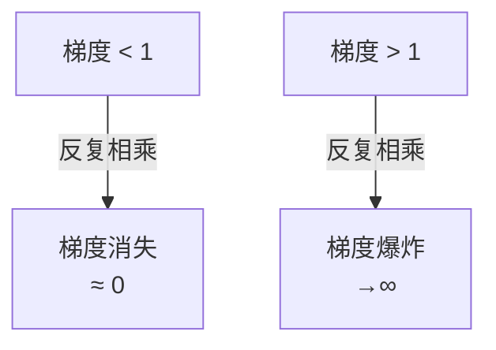

## 反向传播

反向传播是训练神经网络的核心算法。它用**链式法则**计算损失函数对每个参数的梯度。

### 直观理解


前向传播计算输出，反向传播计算梯度。

### 链式法则

对于复合函数 $L = f(g(h(x)))$：

$$
\frac{\partial L}{\partial x} = \frac{\partial L}{\partial f} \cdot \frac{\partial f}{\partial g} \cdot \frac{\partial g}{\partial h} \cdot \frac{\partial h}{\partial x}
$$

### 从零实现

```python
import torch
import torch.nn as nn

# 一个简单的两层网络
class SimpleNet(nn.Module):
    def __init__(self):
        super().__init__()
        self.fc1 = nn.Linear(10, 5)
        self.fc2 = nn.Linear(5, 1)

    def forward(self, x):
        h = torch.relu(self.fc1(x))
        return self.fc2(h)

model = SimpleNet()
x = torch.randn(3, 10)   # batch=3
y = torch.randn(3, 1)    # 目标值

# 前向传播
pred = model(x)
loss = nn.MSELoss()(pred, y)

# 反向传播
loss.backward()

# 查看梯度
print(f"fc1.weight 梯度形状: {model.fc1.weight.grad.shape}")
print(f"fc2.weight 梯度形状: {model.fc2.weight.grad.shape}")
```

### 手动计算梯度

```python
# 手动实现一个计算图的反向传播
x = torch.tensor([2.0], requires_grad=True)
w = torch.tensor([3.0], requires_grad=True)
b = torch.tensor([1.0], requires_grad=True)

# 前向: y = w * x + b,  loss = y²
y = w * x + b
loss = y ** 2

# 反向
loss.backward()

# 手动验证: ∂loss/∂w = 2y * x
y_val = (3.0 * 2.0 + 1.0)  # = 7
expected_grad = 2 * y_val * 2.0  # = 28
print(f"自动求导: {w.grad.item()}, 手动计算: {expected_grad}")
```

### 梯度消失与爆炸



| 问题 | 原因 | 表现 | 解决 |
|------|------|------|------|
| 梯度消失 | 深层网络梯度过小 | 浅层不更新 | ReLU、残差连接、LayerNorm |
| 梯度爆炸 | 深层网络梯度过大 | 参数变为 NaN | 梯度裁剪、学习率调低 |

```python
# 梯度裁剪
torch.nn.utils.clip_grad_norm_(model.parameters(), max_norm=1.0)
```

### 相关页面

- [激活函数](/notes/concepts/activation-functions/) — 激活函数的设计影响梯度流动
- [深度学习入门](/tutorials/deep-learning/) — 反向传播在训练循环中的位置