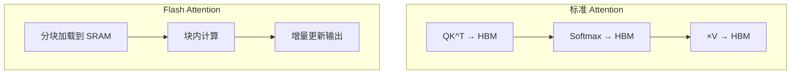

## Flash Attention

Flash Attention 是让大模型推理和训练加速的关键技术，**在不牺牲精度的情况下，将注意力计算加速 2-4 倍，显存降低 5-20 倍**。

### 为什么标准 Attention 慢？

标准 Attention 的计算瓶颈不是计算本身，而是 **GPU 显存读写**：


标准 Attention 需要反复读写大型矩阵（QK^T 和 Softmax 结果），大量时间浪费在数据传输上。

### 核心思想：分块计算

Flash Attention 将 Q、K、V 分成小块，在 GPU 的 SRAM（快缓存）中完成计算，避免频繁读写 HBM：



### 使用方式

```python
# PyTorch 2.0+ 内置支持
import torch

# 自动使用 Flash Attention（如果可用）
with torch.backends.cuda.sdp_kernel(
    enable_flash=True,
    enable_math=False,
    enable_mem_efficient=False,
):
    output = torch.nn.functional.scaled_dot_product_attention(
        query, key, value, attn_mask=mask
    )

# 检查是否支持
print(f"Flash Attention 可用: {torch.cuda.is_flash_attention_available()}")
```

### 在 HuggingFace 中使用

```python
from transformers import AutoModelForCausalLM

# 自动使用 Flash Attention 2
model = AutoModelForCausalLM.from_pretrained(
    "meta-llama/Llama-3.2-3B",
    torch_dtype=torch.bfloat16,
    attn_implementation="flash_attention_2",
)
```

### 性能对比

| 方法 | 速度 | 显存 | 精度 |
|------|------|------|------|
| 标准 Attention | 1x | $O(n^2)$ | 精确 |
| Flash Attention | 2-4x | $O(n)$ | 精确 |
| Flash Attention 2 | 3-5x | $O(n)$ | 精确 |

### 关键论文

- Flash Attention (2022)：首次提出 IO 感知的注意力算法
- Flash Attention 2 (2023)：进一步优化，达到理论峰值的 73%
- Flash Attention 3 (2024)：支持 Hopper 架构新特性

### 相关页面

- [注意力机制](/notes/concepts/attention/) — 理解标准 Attention
- [KV Cache](/notes/concepts/kv-cache/) — 推理优化的另一支柱