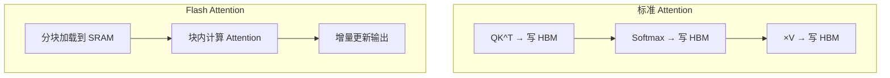

## Flash Attention

Flash Attention 是大模型推理和训练加速的关键技术。**不牺牲精度，注意力计算加速 2-4 倍，显存降低 5-20 倍**。

### 为什么标准 Attention 慢？

标准 Attention 的计算瓶颈不是 GPU 算力，而是**显存带宽**。每次计算都要读写巨型矩阵到 HBM（高带宽显存）：


标准 Attention 需要存储 $QK^T$ 矩阵（$n \times n$），对于 2048 长度的序列就是 16MB，还要反复读写。

### 核心思想：分块计算

Flash Attention 将 Q、K、V 分成小块，在 GPU 的 SRAM（片上缓存，比 HBM 快 10 倍）中完成计算，避免频繁读写 HBM：



### 使用方式

```python
import torch

# PyTorch 2.0+ 内置支持，自动使用 Flash Attention
with torch.backends.cuda.sdp_kernel(
    enable_flash=True,
    enable_math=False,
    enable_mem_efficient=False,
):
    output = torch.nn.functional.scaled_dot_product_attention(
        query, key, value, attn_mask=mask
    )

# 检查是否可用
print(f"Flash Attention 可用: {torch.cuda.is_flash_attention_available()}")
```

### HuggingFace 中使用

```python
from transformers import AutoModelForCausalLM
import torch

model = AutoModelForCausalLM.from_pretrained(
    "meta-llama/Llama-3.2-3B",
    torch_dtype=torch.bfloat16,
    attn_implementation="flash_attention_2",  # 关键
)
```

### 性能对比

| 方法 | 速度 | 显存 | 精度 | 支持 |
|------|------|------|------|------|
| 标准 Attention | 1x | $O(n^2)$ | 精确 | 所有 GPU |
| Flash Attention 1 | 2-3x | $O(n)$ | 精确 | Ampere+ |
| Flash Attention 2 | 3-5x | $O(n)$ | 精确 | Ampere+ |
| Flash Attention 3 | 5-7x | $O(n)$ | 精确 | Hopper |

### 关键论文

- **Flash Attention (2022)**：首次提出 IO 感知的分块注意力算法
- **Flash Attention 2 (2023)**：优化并行策略，达到理论峰值的 73%
- **Flash Attention 3 (2024)**：利用 Hopper 架构的异步执行和 FP8

### 相关页面

- [注意力机制](/notes/concepts/attention/) — 理解标准 Attention
- [KV Cache](/notes/concepts/kv-cache/) — 推理优化的另一支柱