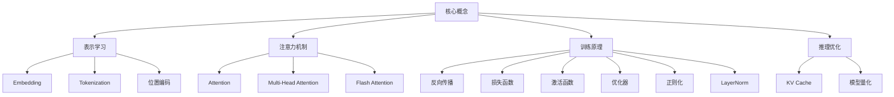

## 核心概念

这里收录 AI 领域的核心概念，每个概念聚焦一个知识点，配有数学公式和 Python 代码实现。

### 概念地图

### 全部概念

| 概念 | 一句话 | 难度 |
|------|--------|------|
| [**注意力机制**](/notes/concepts/attention/) | QKV 三矩阵的数学原理与 PyTorch 实现 | ⭐⭐ |
| [**Multi-Head Attention**](/notes/concepts/multi-head-attention/) | 多头注意力 + MHA/MQA/GQA 对比 | ⭐⭐⭐ |
| [**Embedding**](/notes/concepts/embedding/) | 词嵌入的原理、实现与语义空间 | ⭐ |
| [**Tokenization**](/notes/concepts/tokenization/) | BPE 分词算法、主流 tokenizer 对比 | ⭐ |
| [**位置编码**](/notes/concepts/positional-encoding/) | 正弦编码、RoPE、可学习编码对比 | ⭐⭐ |
| [**激活函数**](/notes/concepts/activation-functions/) | Sigmoid 淘汰原因、ReLU/GELU/SwiGLU 选择 | ⭐⭐ |
| [**反向传播**](/notes/concepts/backpropagation/) | 链式法则、梯度消失与梯度爆炸 | ⭐⭐ |
| [**LayerNorm**](/notes/concepts/layer-norm/) | BN vs LN、Pre-LN vs Post-LN | ⭐⭐ |
| [**损失函数**](/notes/concepts/loss-functions/) | MSE、Cross-Entropy、Triplet 对比 | ⭐⭐ |
| [**优化器**](/notes/concepts/optimizers/) | SGD→Adam→AdamW 演进 + 学习率调度 | ⭐⭐ |
| [**正则化**](/notes/concepts/regularization/) | Dropout、Weight Decay、Early Stopping | ⭐⭐ |
| [**KV Cache**](/notes/concepts/kv-cache/) | 推理加速核心技术，自回归生成代码 | ⭐⭐⭐ |
| [**Flash Attention**](/notes/concepts/flash-attention/) | IO 感知的精确注意力，加速 2-4 倍 | ⭐⭐⭐ |
| [**模型量化**](/notes/concepts/quantization/) | INT4/INT8、GPTQ、AWQ 对比 | ⭐⭐⭐ |

### 学习路径建议

**入门**（无 ML 基础）：Embedding → Tokenization → 激活函数 → 损失函数 → 反向传播

**进阶**（已学 Transformer）：注意力机制 → Multi-Head → 位置编码 → LayerNorm → 优化器

**实战**（部署优化）：KV Cache → Flash Attention → 模型量化 → 正则化