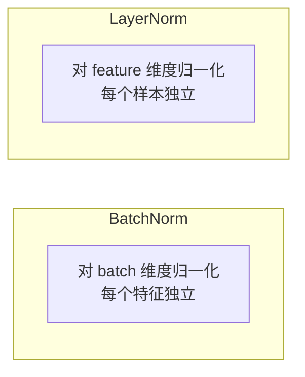

## Layer Normalization

LayerNorm 是 Transformer 稳定训练的关键组件，对每个样本的所有特征做归一化。

### 为什么需要归一化？

深层网络训练时，每层的输出分布不断变化（内部协变量偏移），导致训练不稳定。归一化将每层输出重新规范到稳定分布。

### 公式

$$
\text{LayerNorm}(x) = \gamma \cdot \frac{x - \mu}{\sqrt{\sigma^2 + \epsilon}} + \beta
$$

其中 $\mu$ 和 $\sigma^2$ 在**特征维度**上计算，$\gamma$ 和 $\beta$ 是可学习的缩放和偏移参数。

```python
import torch
import torch.nn as nn

# 使用 PyTorch 内置
layer_norm = nn.LayerNorm(512)  # 512 是特征维度

x = torch.randn(2, 10, 512)  # (batch, seq_len, features)
output = layer_norm(x)
print(f"输出均值: {output.mean():.6f}, 标准差: {output.std():.6f}")
```

### 从零实现

```python
class LayerNorm(nn.Module):
    def __init__(self, dim, eps=1e-5):
        super().__init__()
        self.gamma = nn.Parameter(torch.ones(dim))
        self.beta = nn.Parameter(torch.zeros(dim))
        self.eps = eps

    def forward(self, x):
        mean = x.mean(dim=-1, keepdim=True)
        std = x.std(dim=-1, keepdim=True, unbiased=False)
        return self.gamma * (x - mean) / (std + self.eps) + self.beta

# 测试
ln = LayerNorm(512)
output = ln(x)
print(f"手动实现 - 均值: {output.mean():.6f}, 标准差: {output.std():.6f}")
```

### BatchNorm vs LayerNorm



| 特性 | BatchNorm | LayerNorm |
|------|-----------|-----------|
| 归一化维度 | 对 batch（跨样本） | 对 feature（跨特征） |
| 依赖 batch size | 是 | 否 |
| 适用场景 | CNN | **Transformer、RNN** |
| 训练/推理一致 | 否（需要 running mean） | 是 |

### 为什么 Transformer 用 LayerNorm？

1. 序列长度不固定，BatchNorm 在小 batch 时不稳定
2. LayerNorm 对每个样本独立归一化，训练和推理行为一致
3. 适合 NLP 中变长序列的场景

### Pre-LN vs Post-LN

```
Post-LN（原始 Transformer）:  x → Attention → Add → LN → FFN → Add → LN
Pre-LN（现代做法）:          x → LN → Attention → Add → LN → FFN → Add
```

Pre-LN 训练更稳定，是现代大模型的默认选择。

### 相关页面

- [反向传播](/notes/concepts/backpropagation/) — LayerNorm 帮助梯度稳定流动
- [Transformer 教程](/tutorials/transformer/) — LayerNorm 在 Transformer 中的位置