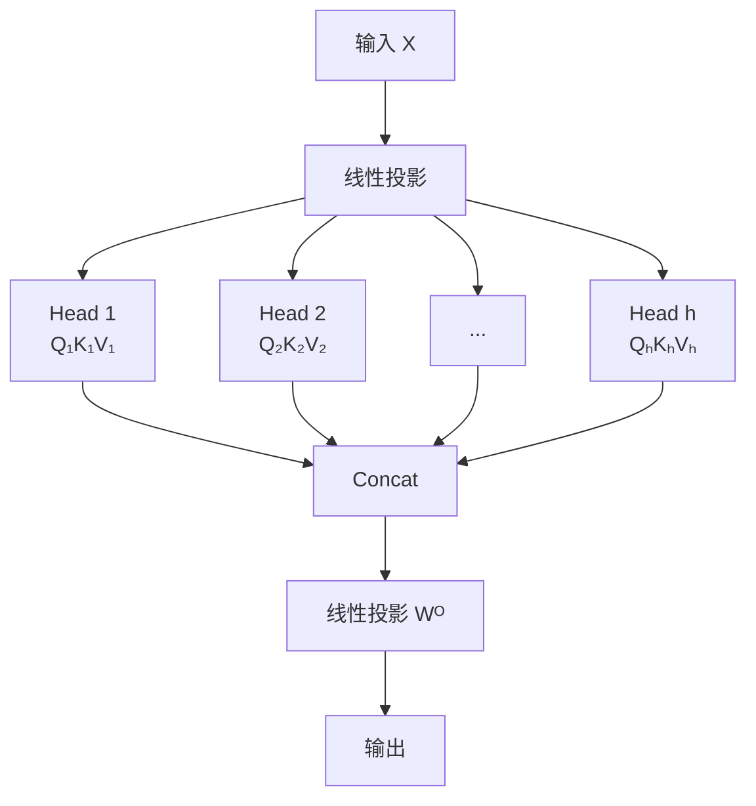

## Multi-Head Attention

单个注意力头只能捕捉一种关系。Multi-Head Attention 让模型**同时关注多种语义关系**。

### 核心思想

将 Q、K、V 投影到多个低维子空间，每个子空间独立计算 Attention，最后拼接：



### 公式

$$
\text{MultiHead}(Q, K, V) = \text{Concat}(\text{head}_1, ..., \text{head}_h)W^O
$$

$$
\text{head}_i = \text{Attention}(QW_i^Q, KW_i^K, VW_i^V)
$$

### 完整实现

```python
import torch
import torch.nn as nn
import math

class MultiHeadAttention(nn.Module):
    def __init__(self, d_model=512, n_heads=8):
        super().__init__()
        assert d_model % n_heads == 0
        self.d_model = d_model
        self.n_heads = n_heads
        self.d_k = d_model // n_heads

        # Q、K、V 的投影矩阵
        self.W_q = nn.Linear(d_model, d_model)
        self.W_k = nn.Linear(d_model, d_model)
        self.W_v = nn.Linear(d_model, d_model)
        self.W_o = nn.Linear(d_model, d_model)

    def forward(self, x, mask=None):
        B, L, _ = x.shape

        # 线性投影 + 拆分为多头
        Q = self.W_q(x).view(B, L, self.n_heads, self.d_k).transpose(1, 2)
        K = self.W_k(x).view(B, L, self.n_heads, self.d_k).transpose(1, 2)
        V = self.W_v(x).view(B, L, self.n_heads, self.d_k).transpose(1, 2)
        # 形状: (B, n_heads, L, d_k)

        # Scaled Dot-Product Attention
        scores = (Q @ K.transpose(-2, -1)) / math.sqrt(self.d_k)
        if mask is not None:
            scores = scores.masked_fill(mask == 0, -1e9)
        attn = torch.softmax(scores, dim=-1)
        out = attn @ V  # (B, n_heads, L, d_k)

        # 拼接多头 + 输出投影
        out = out.transpose(1, 2).contiguous().view(B, L, self.d_model)
        return self.W_o(out), attn


# 测试
mha = MultiHeadAttention(d_model=512, n_heads=8)
x = torch.randn(2, 10, 512)
output, attn_weights = mha(x)
print(f"输出: {output.shape}")     # (2, 10, 512)
print(f"注意力权重: {attn_weights.shape}")  # (2, 8, 10, 10)
```

### 每个头关注什么？

不同头学会关注不同的语义关系：

- **语法头**：关注主谓宾结构（主语 ↔ 谓语动词）
- **指代头**：关注代词指代的名词（"it" ↔ "animal"）
- **语义头**：关注语义相关的词（"eat" ↔ "food"）
- **位置头**：关注相邻的词（"very" ↔ "good"）

- **语法头**：关注主谓宾结构
- **指代头**：关注代词指代的名词
- **语义头**：关注语义相关的词
- **位置头**：关注相邻的词

### Multi-Query / Grouped-Query Attention

| 变体 | K、V 共享方式 | 显存 | 使用者 |
|------|-------------|------|--------|
| MHA | 每个头独立 K、V | 最大 | 原始 Transformer |
| MQA | 所有头共享 K、V | 最小 | PaLM |
| GQA | 分组共享 K、V | 折中 | Llama 2/3 |

### 相关页面

- [注意力机制](/notes/concepts/attention/) — 单头 Attention 的基础
- [KV Cache](/notes/concepts/kv-cache/) — MQA/GQA 减少缓存显存