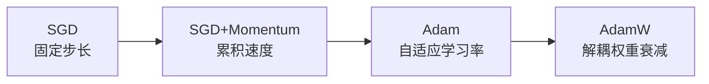

## 优化器

优化器决定**如何用梯度更新模型参数**。选对优化器，训练快几倍。

### 从 SGD 到 Adam 的演进



### SGD：最基础

每步沿负梯度方向移动固定步长：

$$
w_{t+1} = w_t - \alpha \nabla L(w_t)
$$

```python
optimizer = torch.optim.SGD(model.parameters(), lr=0.01)
```

问题：学习率固定，收敛慢，容易被局部极小值困住。

### SGD + Momentum

加入动量项，像球滚下山坡，累积速度冲过局部极小值：

$$
v_t = \beta v_{t-1} + \nabla L(w_t)
$$
$$
w_{t+1} = w_t - \alpha v_t
$$

```python
optimizer = torch.optim.SGD(model.parameters(), lr=0.01, momentum=0.9)
```

### Adam：自适应学习率

Adam 结合 Momentum 和 RMSprop，每个参数有独立的学习率：

$$
m_t = \beta_1 m_{t-1} + (1-\beta_1)\nabla L(w_t)
$$
$$
v_t = \beta_2 v_{t-1} + (1-\beta_2)(\nabla L(w_t))^2
$$
$$
\hat{m}_t = \frac{m_t}{1-\beta_1^t}, \quad \hat{v}_t = \frac{v_t}{1-\beta_2^t}
$$
$$
w_{t+1} = w_t - \alpha \frac{\hat{m}_t}{\sqrt{\hat{v}_t} + \epsilon}
$$

```python
optimizer = torch.optim.Adam(model.parameters(), lr=0.001)
```

### AdamW：解耦权重衰减

Adam 的权重衰减和梯度更新耦合在一起，导致泛化性能下降。AdamW 将它们解耦：

```python
# AdamW 的 weight_decay 是真正的 L2 正则化
optimizer = torch.optim.AdamW(model.parameters(), lr=0.001, weight_decay=0.01)
```

### 学习率调度

```python
from torch.optim.lr_scheduler import CosineAnnealingLR, LinearLR, SequentialLR

# Warmup + Cosine 衰减（Transformer 标配）
warmup = LinearLR(optimizer, start_factor=0.01, total_iters=100)
cosine = CosineAnnealingLR(optimizer, T_max=900)
scheduler = SequentialLR(optimizer, [warmup, cosine], milestones=[100])

for epoch in range(1000):
    optimizer.step()
    scheduler.step()
```

### 选择指南

| 场景 | 推荐 | 原因 |
|------|------|------|
| 需要精细调参 | SGD+Momentum | 更可控 |
| 大多数场景 | Adam | 收敛快，调参少 |
| Transformer 训练 | **AdamW** | 正确的权重衰减 |
| 大模型微调 | AdamW + warmup | 稳定训练 |

### 相关页面

- [反向传播](/notes/concepts/backpropagation/) — 优化器依赖反向传播的梯度
- [大模型原理](/tutorials/llm/) — 大模型训练中的优化器选择