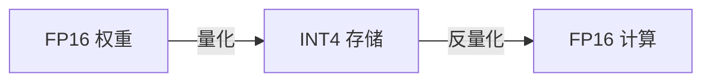

## 模型量化

量化是把模型参数从高精度（FP16/BF16）压缩到低精度（INT8/INT4）。**显存减半以上，速度翻倍，精度几乎不降。**

### 为什么需要量化？

Llama-7B 的参数占用：
- FP16：7B × 2 字节 = **14 GB 显存**（需要 A100）
- INT4：7B × 0.5 字节 = **3.5 GB 显存**（RTX 3060 就能跑）

### 基本原理

$$
q = \text{round}\left(\frac{x - \text{offset}}{\text{scale}}\right)
$$

将连续的浮点值映射到离散的整数范围，存储时用整数，计算时反量化回浮点：



### 量化误差模拟

```python
import torch

x = torch.randn(1000) * 3  # 原始 FP16 数据

# 模拟 INT4 量化（16 个值）
scale = (x.max() - x.min()) / 15
x_quant = torch.round(x / scale) * scale

error = (x - x_quant).abs().mean()
print(f"平均量化误差: {error:.4f}")
print(f"相对误差: {error / x.abs().mean() * 100:.1f}%")
```

### 使用 bitsandbytes 量化

```python
from transformers import AutoModelForCausalLM, BitsAndBytesConfig
import torch

# 4-bit 量化配置
bnb_config = BitsAndBytesConfig(
    load_in_4bit=True,
    bnb_4bit_quant_type="nf4",       # 4-bit NormalFloat
    bnb_4bit_compute_dtype=torch.bfloat16,
    bnb_4bit_use_double_quant=True,  # 双重量化，进一步压缩
)

model = AutoModelForCausalLM.from_pretrained(
    "meta-llama/Llama-3.2-3B",
    quantization_config=bnb_config,
    device_map="auto",
)
print(f"显存: {model.get_memory_footprint() / 1e9:.1f} GB")
```

### 量化方法对比

| 方法 | 精度 | 速度 | 特点 | 适用 |
|------|------|------|------|------|
| GPTQ | INT4/INT8 | 快 | 需校准数据，一次性量化 | 生产部署 |
| AWQ | INT4 | 快 | 保护重要权重通道 | 生产部署 |
| bitsandbytes | INT4/INT8 | 中 | 动态量化，即插即用 | 本地实验 |
| GGUF | INT4-INT8 | 中 | llama.cpp 格式，CPU 友好 | 边缘设备 |

### 选择指南

- 本地跑大模型：**bitsandbytes 4-bit**（最简单）
- 部署到服务器：**GPTQ** 或 **AWQ**（更快）
- 手机/边缘设备：**GGUF**（llama.cpp）
- 训练时节省显存：**QLoRA**（量化 + LoRA）

### 相关页面

- [KV Cache](/notes/concepts/kv-cache/) — 量化和 KV Cache 是显存优化两大支柱
- [模型部署](/tutorials/rag-agent/deployment/) — 部署中的量化实践