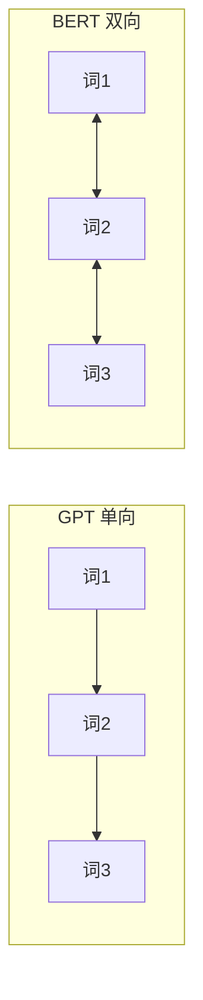

## BERT

BERT（Bidirectional Encoder Representations from Transformers）是 Google 2018 年提出的预训练模型，**首次在 11 项 NLP 任务上刷新纪录**。

### 与 GPT 的核心区别



| 特性 | GPT | BERT |
|------|-----|------|
| 方向 | 单向（左→右） | **双向** |
| 预训练 | 预测下一个词 | 预测被遮住的词 |
| 架构 | Decoder only | Encoder only |
| 擅长 | 文本生成 | 文本理解 |
| 参数量 | 117M-175B | 110M / 340M |

### 预训练：MLM

Masked Language Model——随机遮住 15% 的词，让模型预测。被遮住的词中：
- 80% 替换为 `[MASK]`
- 10% 替换为随机词
- 10% 保持不变

```python
from transformers import AutoModelForMaskedLM, AutoTokenizer

model = AutoModelForMaskedLM.from_pretrained("bert-base-uncased")
tokenizer = AutoTokenizer.from_pretrained("bert-base-uncased")

text = "Paris is the [MASK] of France."
inputs = tokenizer(text, return_tensors="pt")
outputs = model(**inputs)

mask_idx = (inputs["input_ids"] == tokenizer.mask_token_id).nonzero()[0, 1]
predicted = outputs.logits[0, mask_idx].argmax()
print(f"预测: {tokenizer.decode(predicted)}")  # capital
```

### 输入格式

```
[CLS] 句子A [SEP] 句子B [SEP]
```

- `[CLS]`：分类 token，其输出用于句子级分类
- `[SEP]`：分隔符，同时标记句子边界
- Token Embedding + Segment Embedding + Position Embedding

### 微调示例

```python
from transformers import AutoModelForSequenceClassification, Trainer, TrainingArguments

model = AutoModelForSequenceClassification.from_pretrained(
    "bert-base-uncased", num_labels=2
)

training_args = TrainingArguments(
    output_dir="./results",
    num_train_epochs=3,
    per_device_train_batch_size=16,
    learning_rate=2e-5,
)

trainer = Trainer(model=model, args=training_args, train_dataset=train_dataset)
trainer.train()
```

### BERT 的局限

- 只能做理解，不能做生成
- 输入长度固定 512 tokens
- 被 GPT 系列在生成任务上全面超越
- 但其"预训练+微调"范式影响深远

### 相关页面

- [GPT 系列](/notes/models/gpt/) — 解码器路线的代表
- [Attention 论文](/notes/papers/attention-is-all-you-need/) — BERT 的底层架构