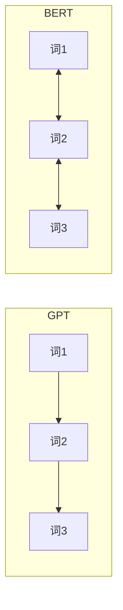

## BERT

BERT（Bidirectional Encoder Representations from Transformers）是 Google 在 2018 年提出的预训练模型，**首次在 11 项 NLP 任务上刷新纪录**。

### 与 GPT 的核心区别



| 特性 | GPT | BERT |
|------|-----|------|
| 方向 | 单向（左→右） | **双向** |
| 预训练 | 预测下一个词 | 预测被遮住的词 |
| 架构 | Decoder only | Encoder only |
| 擅长 | 文本生成 | 文本理解 |

### 预训练：MLM

Masked Language Model——随机遮住 15% 的词，让模型预测：

```
输入: The [MASK] sat on the [MASK]
预测: cat, mat
```

```python
from transformers import AutoModelForMaskedLM, AutoTokenizer

model = AutoModelForMaskedLM.from_pretrained("bert-base-uncased")
tokenizer = AutoTokenizer.from_pretrained("bert-base-uncased")

text = "Paris is the [MASK] of France."
inputs = tokenizer(text, return_tensors="pt")
outputs = model(**inputs)

mask_idx = (inputs["input_ids"] == tokenizer.mask_token_id).nonzero()[0, 1]
predicted = outputs.logits[0, mask_idx].argmax()
print(f"预测: {tokenizer.decode(predicted)}")  # capital
```

### 输入格式

```
[CLS] 句子A [SEP] 句子B [SEP]
```

- `[CLS]`：分类 token，其输出用于句子级任务
- `[SEP]`：分隔符，区分两个句子

### 微调示例

```python
from transformers import AutoModelForSequenceClassification, Trainer

# 加载预训练 BERT，加分类头
model = AutoModelForSequenceClassification.from_pretrained(
    "bert-base-uncased", num_labels=2
)

# 微调
trainer = Trainer(
    model=model,
    args=TrainingArguments(output_dir="./results", num_train_epochs=3),
    train_dataset=train_dataset,
)
trainer.train()
```

### BERT 的影响

- 开启了 NLP 的"预训练 + 微调"时代
- 衍生出 RoBERTa、ALBERT、DistilBERT 等变体
- 虽然已被大模型取代，但其思想影响深远

### 相关页面

- [GPT 系列](/notes/models/gpt/) — 解码器路线的代表
- [模型族谱](/notes/models/) — 全部模型对比