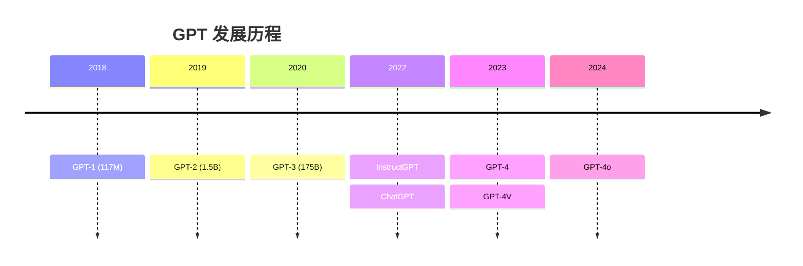

## GPT 系列

GPT（Generative Pre-trained Transformer）是 OpenAI 的生成式模型系列，从 2018 年到 2024 年经历了四次重大迭代。



### GPT-1：预训练 + 微调范式

核心思想：**先在大规模无标注文本上预训练，再在具体任务上微调**。

```python
from transformers import AutoModelForCausalLM, AutoTokenizer

# GPT-2 是 GPT-1 的放大版，架构相同
model = AutoModelForCausalLM.from_pretrained("gpt2")
tokenizer = AutoTokenizer.from_pretrained("gpt2")

text = "The future of AI is"
inputs = tokenizer(text, return_tensors="pt")
outputs = model.generate(**inputs, max_new_tokens=30, do_sample=True)
print(tokenizer.decode(outputs[0]))
```

### GPT-2：Zero-shot 能力

GPT-2 证明了**规模的重要性**——1.5B 参数时，模型开始展现出零样本能力，不需要微调就能完成一些任务。

### GPT-3：Few-shot 学习

175B 参数，通过提示词中的几个示例（few-shot）就能适应新任务，不再需要微调。

### GPT-3.5 / ChatGPT：对话对齐

- 基于 GPT-3，加入 **RLHF**（人类反馈强化学习）
- 2022 年 11 月发布 ChatGPT，两个月用户破亿
- 学会了对话、遵循指令、拒绝有害请求

### GPT-4：多模态与推理

- 支持图像输入（GPT-4V）
- 128K 上下文窗口
- 在律师考试、SAT 等测试中达到人类前 10% 水平

### 关键创新

| 模型 | 核心创新 |
|------|---------|
| GPT-1 | 生成式预训练范式 |
| GPT-2 | 规模扩大 → 涌现能力 |
| GPT-3 | Few-shot 学习 |
| InstructGPT | RLHF 对齐 |
| GPT-4 | 多模态 + 推理能力跃升 |

### 相关页面

- [模型族谱](/notes/models/) — 全部模型对比
- [BERT](/notes/models/bert/) — 编码器路线的代表