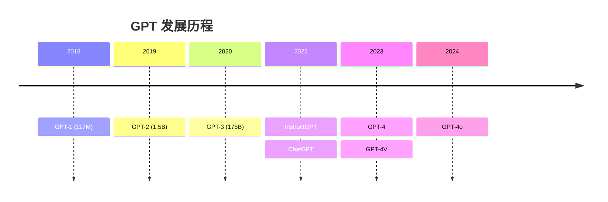

## GPT 系列

GPT 是 OpenAI 的生成式模型系列，从 2018 年到 2024 年经历四次重大迭代。**GPT 系列定义了现代大语言模型的技术路线。**



### GPT-1：预训练 + 微调范式

核心思想：**先在大规模无标注文本上预训练，再在具体任务上微调**。

架构：12 层 Transformer Decoder，117M 参数，在 BooksCorpus 上预训练。

```python
from transformers import AutoModelForCausalLM, AutoTokenizer

# GPT-2 是 GPT-1 的放大版，架构相同
model = AutoModelForCausalLM.from_pretrained("gpt2")
tokenizer = AutoTokenizer.from_pretrained("gpt2")

text = "The future of AI is"
inputs = tokenizer(text, return_tensors="pt")
outputs = model.generate(**inputs, max_new_tokens=30, do_sample=True)
print(tokenizer.decode(outputs[0]))
```

### GPT-2：涌现能力初现

1.5B 参数，在 WebText（800 万网页）上训练。GPT-2 证明了**规模扩大后，模型开始展现出零样本能力**——不需要微调就能完成翻译、摘要等任务。

### GPT-3：Few-shot 学习

175B 参数，通过提示词中的几个示例就能适应新任务：

```
将英文翻译成中文：

English: Hello → 中文: 你好
English: Goodbye → 中文: 再见
English: Thank you → 中文:
```

### InstructGPT / ChatGPT：RLHF 对齐

GPT-3 虽然强大，但经常不遵循指令。InstructGPT 引入了 RLHF（人类反馈强化学习）三步流程：

1. **SFT**：收集人类演示数据，监督微调
2. **RM**：标注员对回答排序，训练奖励模型
3. **PPO**：用 RM 打分，强化学习优化策略

```python
# RLHF 后的模型能更好地遵循指令
messages = [
    {"role": "system", "content": "你是一个有帮助的助手。"},
    {"role": "user", "content": "用一句话解释量子计算"},
]
response = model.generate(...)
```

### GPT-4：多模态与推理

- 支持图像输入（GPT-4V）
- 128K 上下文窗口
- 在律师考试（Bar Exam）中达到前 10% 水平
- GPT-4o 进一步统一了文本、图像、语音处理

### 关键技术演进

| 模型 | 参数 | 训练数据 | 核心创新 |
|------|------|---------|---------|
| GPT-1 | 117M | 7K 本书 | 预训练+微调范式 |
| GPT-2 | 1.5B | 800 万网页 | 零样本学习 |
| GPT-3 | 175B | 570GB | Few-shot 学习 |
| ChatGPT | ~175B | +人类数据 | RLHF 对齐 |
| GPT-4 | ~1.8T | 未公开 | 多模态 |

### 相关页面

- [BERT](/notes/models/bert/) — 编码器路线的代表
- [InstructGPT 论文](/notes/papers/instruct-gpt/) — RLHF 技术详解