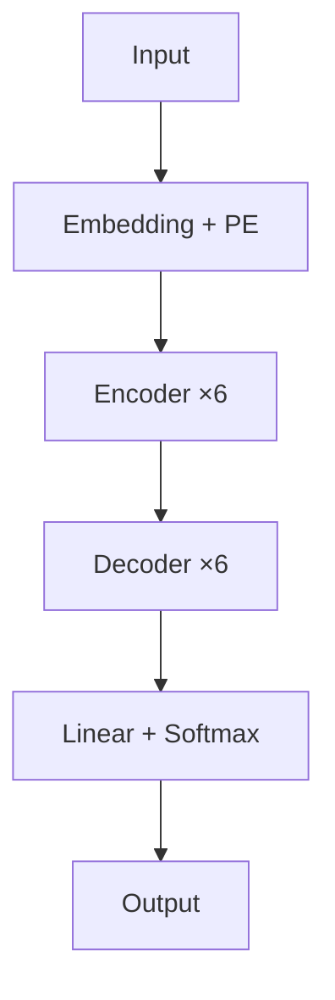

## Attention Is All You Need

**作者**：Vaswani et al. (Google Brain, 2017)  
**引用**：超过 100,000 次  
**意义**：提出 Transformer 架构，彻底改变了 AI 领域

### 核心贡献

抛弃了 RNN 和 CNN，完全基于 **Self-Attention** 构建序列模型：

### 架构细节

| 组件 | 参数 |
|------|------|
| $d_{\text{model}}$ | 512 |
| 注意力头数 $h$ | 8 |
| $d_k, d_v$ | 64 |
| FFN 隐藏层 | 2048 |
| Encoder 层数 | 6 |
| Decoder 层数 | 6 |
| Dropout | 0.1 |
| 优化器 | Adam ($\beta_1=0.9, \beta_2=0.98$) |
| 学习率 | warmup 4000 步后衰减 |

### 关键公式

**Scaled Dot-Product Attention**：

$$
\text{Attention}(Q, K, V) = \text{softmax}\left(\frac{QK^T}{\sqrt{d_k}}\right)V
$$

**Multi-Head Attention**：

$$
\text{MultiHead}(Q, K, V) = \text{Concat}(\text{head}_1, ..., \text{head}_h)W^O
$$

**位置编码**：

$$
PE_{(pos, 2i)} = \sin(pos / 10000^{2i/d_{\text{model}}})
$$

### 实验结果

在 WMT 2014 英德翻译任务上：

| 模型 | BLEU | 训练成本 |
|------|------|---------|
| 之前最佳 (ConvS2S) | 26.4 | 高 |
| Transformer (base) | 27.3 | **1/4** |
| Transformer (big) | **28.4** | 1/3 |

### 为什么重要？

1. **并行计算**：训练时间大幅缩短
2. **长距离依赖**：O(1) 路径长度
3. **通用性**：从 NLP 扩展到 CV、语音、多模态

### 论文名言

> "The dominant sequence transduction models are based on complex recurrent or convolutional neural networks... We propose a new simple network architecture, the Transformer, based solely on attention mechanisms."

### 相关页面

- [Transformer 教程](/tutorials/transformer/) — 论文的完整实现
- [注意力机制](/notes/concepts/attention/) — 论文的核心机制