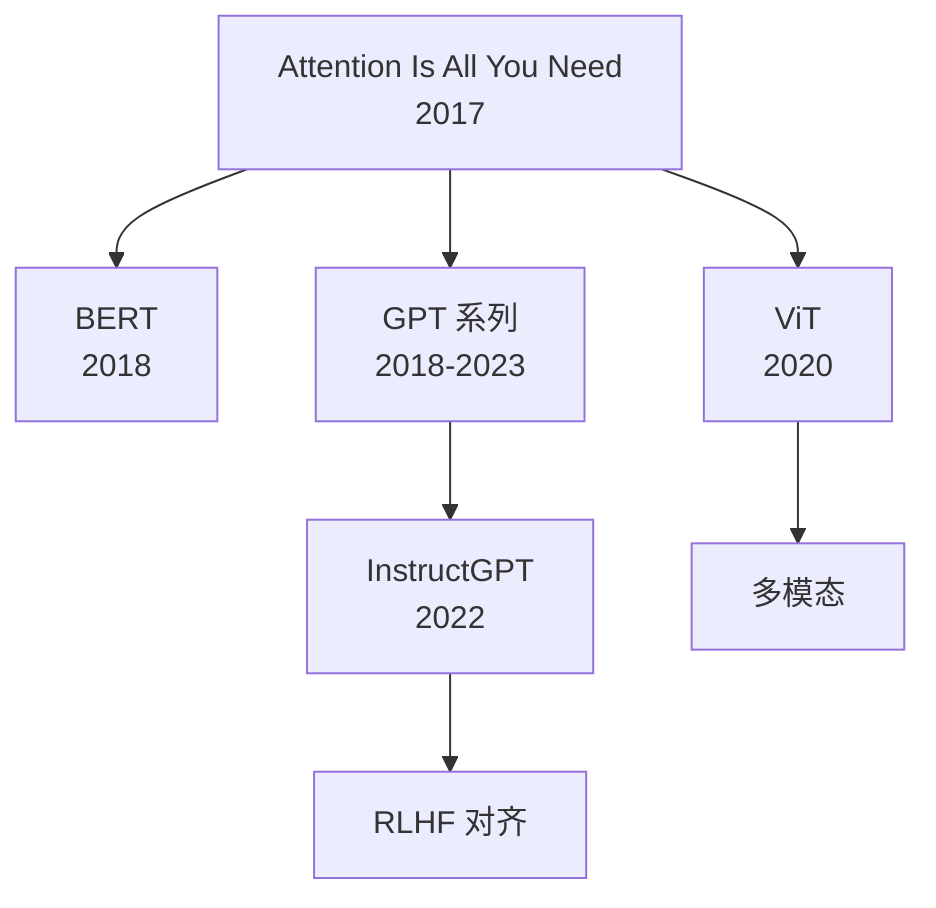

## 详细解读

- [**Attention Is All You Need**](/notes/papers/attention-is-all-you-need/) — Transformer 架构的完整解读
- [**InstructGPT**](/notes/papers/instruct-gpt/) — RLHF 对齐技术的奠基论文

## 经典论文地图

## "Attention Is All You Need" (2017)

**作者**：Vaswani et al. (Google Brain)  
**引用**：超过 100,000 次  
**意义**：提出 Transformer 架构，完全取代了 RNN 在序列建模中的地位。

### 核心贡献

1. **完全基于 Attention 的架构**：不使用任何循环或卷积
2. **Multi-Head Attention**：多个注意力头并行捕捉不同粒度的关系
3. **位置编码**：用正弦函数编码位置信息
4. **训练效率**：可并行计算，训练速度远超 RNN

### 关键公式

缩放点积注意力：

$$
\text{Attention}(Q, K, V) = \text{softmax}\left(\frac{QK^T}{\sqrt{d_k}}\right)V
$$

Multi-Head Attention：

$$
\text{MultiHead}(Q, K, V) = \text{Concat}(\text{head}_1, ..., \text{head}_h)W^O
$$

其中 $\text{head}_i = \text{Attention}(QW_i^Q, KW_i^K, VW_i^V)$

### 架构要点

- Encoder：6 层，每层有 Self-Attention + FFN
- Decoder：6 层，每层有 Masked Self-Attention + Cross-Attention + FFN
- $d_{\text{model}} = 512$，$h = 8$ 个头，$d_k = d_v = 64$
- 在 WMT 2014 英德翻译任务上达到 28.4 BLEU（当时最佳）

---

## "BERT: Pre-training of Deep Bidirectional Transformers" (2018)

**作者**：Devlin et al. (Google AI)  
**意义**：提出双向预训练范式，在 11 项 NLP 任务上刷新纪录。

### 核心贡献

1. **Masked Language Model (MLM)**：随机 mask 15% 的 token，训练模型预测被 mask 的词
2. **Next Sentence Prediction (NSP)**：判断两句话是否连续
3. **双向上下文**：与 GPT 的单向不同，BERT 能同时看到前后文

### 预训练细节

- 数据：BooksCorpus (800M 词) + English Wikipedia (2.5B 词)
- 两个版本：BERT-base (110M 参数) / BERT-large (340M 参数)
- 输入格式：`[CLS] 句子A [SEP] 句子B [SEP]`

### 微调范式

BERT 通过添加一个简单的分类头即可适配各种下游任务：
- 单句分类：取 `[CLS]` 的输出
- 句子对分类：同上
- 序列标注：取每个 token 的输出
- 问答：预测答案的起始和结束位置

---

## "Training language models to follow instructions" (InstructGPT, 2022)

**作者**：Ouyang et al. (OpenAI)  
**意义**：提出 RLHF 方法，让大模型对齐人类意图。

### 三步流程

1. **SFT（监督微调）**：收集人类写的 prompt-answer 对，微调 GPT-3
2. **RM（奖励模型训练）**：让标注员对多个回答排序，训练奖励模型
3. **PPO（强化学习）**：用奖励模型通过 PPO 算法优化策略

### 关键发现

- 1.3B 的 InstructGPT 比 175B 的 GPT-3 更受人类偏好
- RLHF 显著减少了有害输出和编造信息
- 在"真实性"（Truthfulness）指标上大幅提升

### 后续影响

- RLHF 成为 ChatGPT、Claude 等产品的核心对齐技术
- DPO (2023) 提出了更简单的替代方案，无需显式训练奖励模型

---

## 论文阅读建议

- 先读 Abstract + Conclusion，了解核心贡献
- 再看图和表，理解架构
- 最后读实验细节
- 配合代码实现加深理解

### 相关页面

- [核心概念](/notes/concepts/) — 论文中的关键技术
- [模型族谱](/notes/models/) — 论文背后的模型