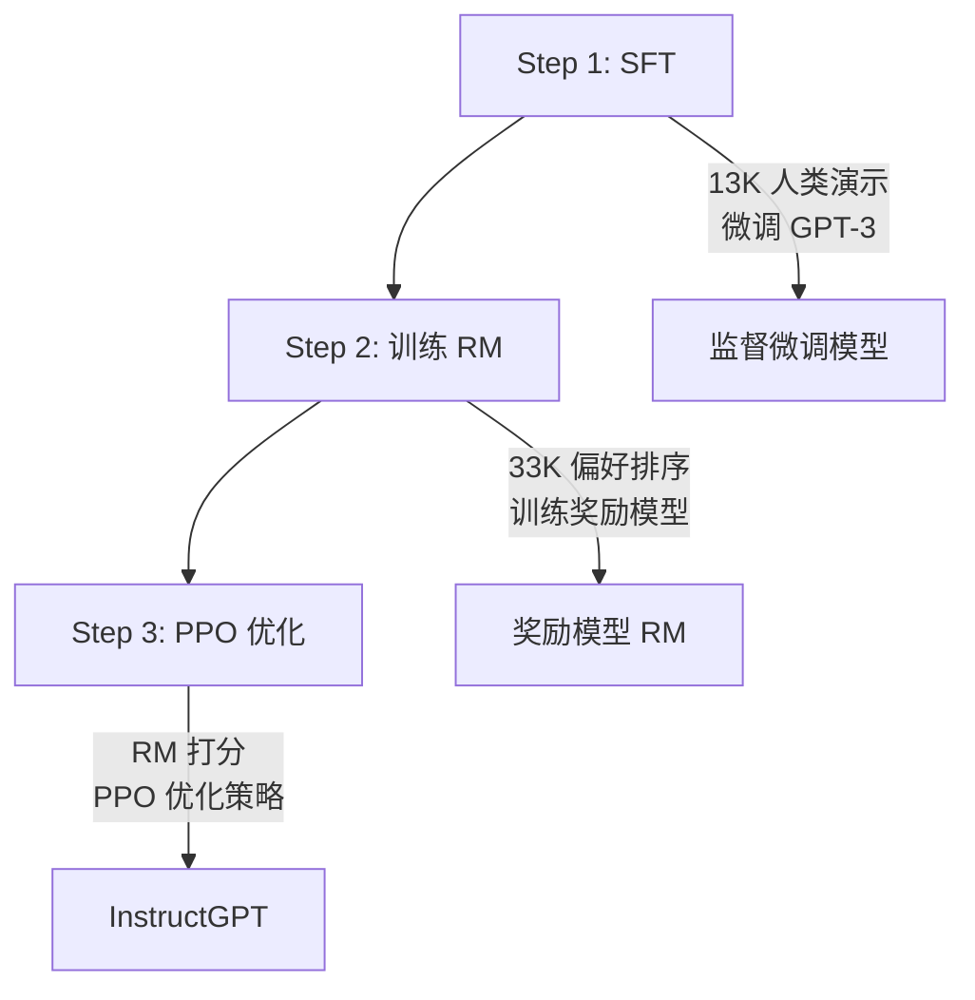

## InstructGPT

**作者**：Ouyang et al. (OpenAI, 2022)  
**全称**：Training language models to follow instructions with human feedback

### 核心问题

GPT-3 很强大，但经常**不遵循用户意图**——编造事实、输出有害内容、不理解指令。InstructGPT 用 RLHF 解决了这个问题。

### 三步流程



### Step 1：监督微调 (SFT)

收集 13K 人类写的 prompt-answer 对，微调 GPT-3：

```
标注员写回答:
Prompt: "解释什么是机器学习"
Answer: "机器学习是让计算机从数据中学习规律..."
```

### Step 2：训练奖励模型 (RM)

让标注员对多个回答**排序**（而非打分），训练奖励模型：

```
Prompt: "写一首关于 AI 的诗"

回答 A: "芯片闪烁着智慧的光芒..."  ← 排第 1
回答 B: "AI is a technology..."      ← 排第 2  
回答 C: "什么是AI？AI就是..."       ← 排第 3
```

### Step 3：PPO 优化

用奖励模型通过 PPO 优化策略，同时加 KL 惩罚防止偏离太远：

$$
\text{目标} = \mathbb{E}[R(x, y)] - \beta \cdot \text{KL}(\pi_{\theta} \| \pi_{\text{SFT}})
$$

### 关键发现

| 发现 | 数据 |
|------|------|
| 1.3B InstructGPT 胜过 175B GPT-3 | 标注员偏好 85% vs 15% |
| 幻觉显著减少 | TruthfulQA 准确率提升 2 倍 |
| 有害输出大幅下降 | 毒性降低 25% |

### 影响

- 直接催生了 ChatGPT（2022.11）
- RLHF 成为 Claude、Gemini 的标准对齐方法
- DPO (2023) 提出了无需奖励模型的更简单替代方案

### 相关页面

- [大模型原理](/tutorials/llm/) — 训练三阶段详解
- [RLHF](/notes/concepts/) — 人类反馈强化学习