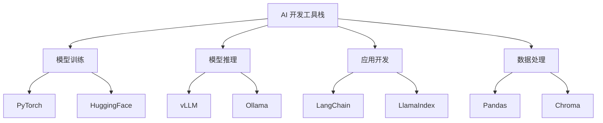

## AI 开发工具栈



### PyTorch — 深度学习框架

```python
import torch
import torch.nn as nn

# 定义一个 MLP
class MLP(nn.Module):
    def __init__(self):
        super().__init__()
        self.layers = nn.Sequential(
            nn.Linear(768, 256),
            nn.ReLU(),
            nn.Dropout(0.1),
            nn.Linear(256, 10),
        )
    def forward(self, x):
        return self.layers(x)

model = MLP()
x = torch.randn(4, 768)
print(model(x).shape)  # (4, 10)
```

### HuggingFace Transformers

```python
from transformers import AutoModelForCausalLM, AutoTokenizer

model = AutoModelForCausalLM.from_pretrained("gpt2")
tokenizer = AutoTokenizer.from_pretrained("gpt2")

inputs = tokenizer("The future of AI is", return_tensors="pt")
outputs = model.generate(**inputs, max_new_tokens=30)
print(tokenizer.decode(outputs[0]))
```

### LangChain

```python
from langchain.chat_models import ChatOpenAI
from langchain.prompts import ChatPromptTemplate

llm = ChatOpenAI(model="gpt-4o", temperature=0.7)
prompt = ChatPromptTemplate.from_messages([
    ("system", "你是一个 AI 技术专家。"),
    ("human", "用一句话解释 {concept}"),
])
chain = prompt | llm
response = chain.invoke({"concept": "Transformer"})
print(response.content)
```

### Ollama — 本地运行

```bash
ollama pull llama3.2
ollama run llama3.2 "解释什么是注意力机制"
```

```python
import ollama
response = ollama.chat(
    model="llama3.2",
    messages=[{"role": "user", "content": "什么是 Transformer？"}],
)
print(response["message"]["content"])
```

### 向量数据库：Chroma

```python
import chromadb

client = chromadb.Client()
collection = client.create_collection("docs")

collection.add(
    documents=["Transformer 是 Attention 机制的架构", "CNN 用于图像处理"],
    ids=["doc1", "doc2"],
)

results = collection.query(
    query_texts=["什么是 Attention"],
    n_results=1,
)
print(results["documents"][0])
```

### 工具选择指南

| 场景 | 推荐工具 |
|------|----------|
| 模型训练 | PyTorch + HuggingFace |
| 快速原型 | Ollama + LangChain |
| 生产部署 | vLLM / TGI |
| 向量检索 | Chroma (原型) / Milvus (生产) |
| 数据标注 | Label Studio |
| 实验追踪 | Weights & Biases |

### 相关页面

- [核心概念](/notes/concepts/) — 工具背后的技术原理
- [模型族谱](/notes/models/) — 用这些工具运行的模型