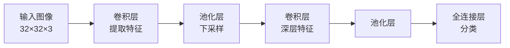

## CNN：卷积神经网络

CNN 通过**局部感知**和**权重共享**，大幅减少参数量，是图像处理的标配。



### 卷积：局部特征提取

卷积核在图像上滑动，每个位置做点积：

```python
import torch.nn as nn

# 输入 3 通道，输出 16 通道，3×3 卷积核
conv = nn.Conv2d(in_channels=3, out_channels=16, kernel_size=3, padding=1)

import torch
image = torch.randn(1, 3, 32, 32)  # 一张 RGB 图片
output = conv(image)
print(f"输出: {output.shape}")  # (1, 16, 32, 32)
```

### 池化：降低尺寸

```python
pool = nn.MaxPool2d(kernel_size=2, stride=2)
pooled = pool(output)
print(f"池化后: {pooled.shape}")  # (1, 16, 16, 16) — 尺寸减半
```

### LeNet-5 实现

```python
class LeNet(nn.Module):
    def __init__(self):
        super().__init__()
        self.features = nn.Sequential(
            nn.Conv2d(1, 6, 5), nn.ReLU(),
            nn.MaxPool2d(2),
            nn.Conv2d(6, 16, 5), nn.ReLU(),
            nn.MaxPool2d(2),
        )
        self.classifier = nn.Sequential(
            nn.Linear(16*4*4, 120), nn.ReLU(),
            nn.Linear(120, 84), nn.ReLU(),
            nn.Linear(84, 10),
        )

    def forward(self, x):
        x = self.features(x)
        x = x.view(x.size(0), -1)
        return self.classifier(x)
```

### 架构演进

| 架构 | 年份 | 核心贡献 |
|------|------|----------|
| LeNet | 1998 | 卷积+池化+全连接 |
| AlexNet | 2012 | ReLU+Dropout+GPU |
| ResNet | 2015 | 残差连接，可训练 152 层 |

### 下一步

- [RNN/LSTM](/tutorials/deep-learning/rnn/) — 序列模型
- [Transformer](/tutorials/transformer/) — 取代 CNN 的通用架构