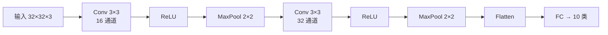

## CNN：卷积神经网络

CNN 通过**局部感知**和**权重共享**，用远少于全连接层的参数处理图像。



### 卷积层

卷积核在图像上滑动，每个位置计算点积。一个 3×3 卷积核只有 9 个参数，但能检测边缘、纹理等局部特征。

```python
import torch
import torch.nn as nn

conv = nn.Conv2d(in_channels=3, out_channels=16, kernel_size=3, padding=1)
image = torch.randn(1, 3, 32, 32)
output = conv(image)
print(f"输出: {output.shape}")  # (1, 16, 32, 32)
```

**参数量计算**：3×3×3×16 + 16(偏置) = 448 个参数。如果用全连接：32×32×3 × 32×32×16 ≈ 50 亿参数。

### 池化层

```python
pool = nn.MaxPool2d(kernel_size=2, stride=2)
pooled = pool(output)
print(f"池化后: {pooled.shape}")  # (1, 16, 16, 16) — 尺寸减半
```

### LeNet-5 完整实现

```python
class LeNet(nn.Module):
    def __init__(self):
        super().__init__()
        self.features = nn.Sequential(
            nn.Conv2d(1, 6, 5), nn.ReLU(),
            nn.MaxPool2d(2),           # 28→14
            nn.Conv2d(6, 16, 5), nn.ReLU(),
            nn.MaxPool2d(2),           # 10→5
        )
        self.classifier = nn.Sequential(
            nn.Linear(16*5*5, 120), nn.ReLU(),
            nn.Linear(120, 84), nn.ReLU(),
            nn.Linear(84, 10),
        )

    def forward(self, x):
        x = self.features(x)
        x = x.view(x.size(0), -1)
        return self.classifier(x)

model = LeNet()
x = torch.randn(1, 1, 28, 28)
print(model(x).shape)  # (1, 10)
```

### 架构演进

| 架构 | 年份 | 核心贡献 | 层数 |
|------|------|---------|------|
| LeNet | 1998 | 卷积+池化+全连接 | 5 |
| AlexNet | 2012 | ReLU+Dropout+GPU | 8 |
| VGG16 | 2014 | 小卷积核堆叠 | 16 |
| ResNet50 | 2015 | 残差连接，解决退化 | 50 |

### ResNet 残差块

$$
y = F(x) + x
$$

跳连接让梯度直接流过，训练上百层也不退化：

```python
class ResidualBlock(nn.Module):
    def __init__(self, channels):
        super().__init__()
        self.conv1 = nn.Conv2d(channels, channels, 3, padding=1)
        self.conv2 = nn.Conv2d(channels, channels, 3, padding=1)

    def forward(self, x):
        residual = x
        out = torch.relu(self.conv1(x))
        out = self.conv2(out)
        return torch.relu(out + residual)  # 关键：加上输入
```

### 1×1 卷积

看似无用，实则精妙——在通道维度上做线性变换，不改变空间尺寸：

```python
conv1x1 = nn.Conv2d(256, 64, kernel_size=1)
x = torch.randn(1, 256, 14, 14)
print(conv1x1(x).shape)  # (1, 64, 14, 14)
```

用途：降维、增加非线性、减少参数。

### 相关页面

- [RNN/LSTM](/tutorials/deep-learning/rnn/) — 序列模型
- [Transformer](/tutorials/transformer/) — 取代 CNN 的通用架构