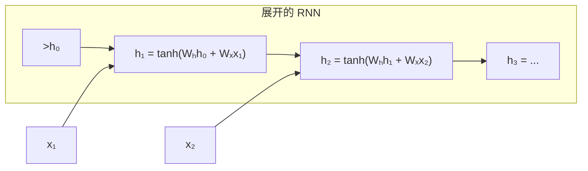
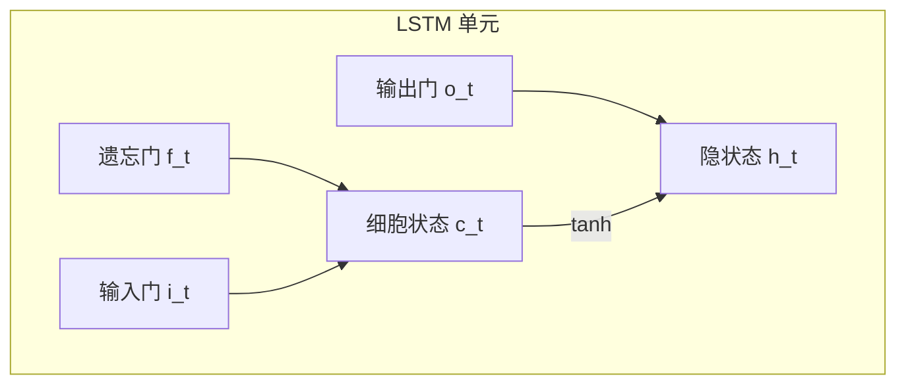

## RNN：循环神经网络

RNN 的核心思想：**序列中每个位置的输出不仅依赖当前输入，还依赖之前的状态**。



### 数学定义

$$
h_t = \tanh(W_h h_{t-1} + W_x x_t + b)
$$

$$
y_t = \text{softmax}(W_y h_t + b_y)
$$

$W_h$ 和 $W_x$ 在所有时间步**共享**，这是 RNN 能处理变长序列的关键。

### 基础 RNN 实现

```python
import torch
import torch.nn as nn

rnn = nn.RNN(input_size=128, hidden_size=256, num_layers=1, batch_first=True)
x = torch.randn(2, 10, 128)  # (batch=2, seq_len=10, features=128)
output, hidden = rnn(x)
print(f"输出: {output.shape}, 最终隐状态: {hidden.shape}")
# 输出: (2, 10, 256), 最终隐状态: (1, 2, 256)
```

### RNN 的致命问题

反向传播时，梯度经过 $W_h$ 反复相乘：

$$
\frac{\partial L}{\partial h_1} \propto W_h^{T-1}
$$

- 如果 $W_h$ 的特征值 < 1 → **梯度消失**，早期时间步无法学习
- 如果 $W_h$ 的特征值 > 1 → **梯度爆炸**，参数变为 NaN

```python
# 梯度裁剪是防止爆炸的常用手段
torch.nn.utils.clip_grad_norm_(rnn.parameters(), max_norm=1.0)
```

## LSTM：长短期记忆

LSTM 通过**门控机制**解决梯度消失问题。它维护一个**细胞状态** $c_t$，信息可以不受阻碍地流过：



### 三个门

| 门 | 公式 | 作用 |
|----|------|------|
| 遗忘门 | $f_t = \sigma(W_f \cdot [h_{t-1}, x_t] + b_f)$ | 决定丢弃哪些旧信息 |
| 输入门 | $i_t = \sigma(W_i \cdot [h_{t-1}, x_t] + b_i)$ | 决定存储哪些新信息 |
| 候选值 | $\tilde{c}_t = \tanh(W_c \cdot [h_{t-1}, x_t] + b_c)$ | 新候选信息 |
| 更新 | $c_t = f_t \odot c_{t-1} + i_t \odot \tilde{c}_t$ | 更新细胞状态 |
| 输出门 | $o_t = \sigma(W_o \cdot [h_{t-1}, x_t] + b_o)$ | 决定输出什么 |
| 隐状态 | $h_t = o_t \odot \tanh(c_t)$ | 最终输出 |

### 代码实现

```python
lstm = nn.LSTM(input_size=128, hidden_size=256, num_layers=1, batch_first=True)

x = torch.randn(2, 10, 128)
output, (hidden, cell) = lstm(x)
print(f"输出: {output.shape}")           # (2, 10, 256)
print(f"隐状态: {hidden.shape}")         # (1, 2, 256)
print(f"细胞状态: {cell.shape}")         # (1, 2, 256)
```

### 双向 LSTM

同时从前向和后向处理序列，捕获上下文：

```python
bilstm = nn.LSTM(128, 256, bidirectional=True, batch_first=True)
output, _ = bilstm(x)
print(f"双向输出: {output.shape}")  # (2, 10, 512) — 256×2
```

### RNN vs LSTM vs Transformer

| 特性 | RNN | LSTM | Transformer |
|------|-----|------|-------------|
| 并行计算 | ❌ | ❌ | ✅ |
| 长距离依赖 | ❌ | ✅ | ✅ (O(1)) |
| 训练速度 | 慢 | 慢 | 快 |
| 推理速度 | 快 | 中 | 中（可用 KV Cache） |

### 应用场景

- 时间序列预测（股价、天气）
- 语音识别（CTC 损失）
- 文本生成（字符级 RNN）
- 机器翻译（Seq2Seq + Attention）

### 相关页面

- [CNN](/tutorials/deep-learning/cnn/) — 图像处理架构
- [Transformer](/tutorials/transformer/) — 取代 RNN 的现代架构