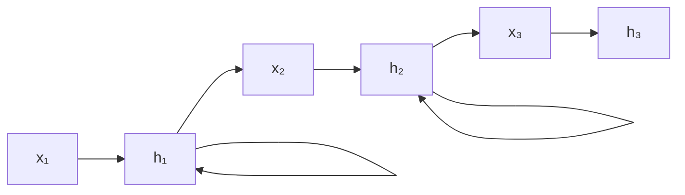
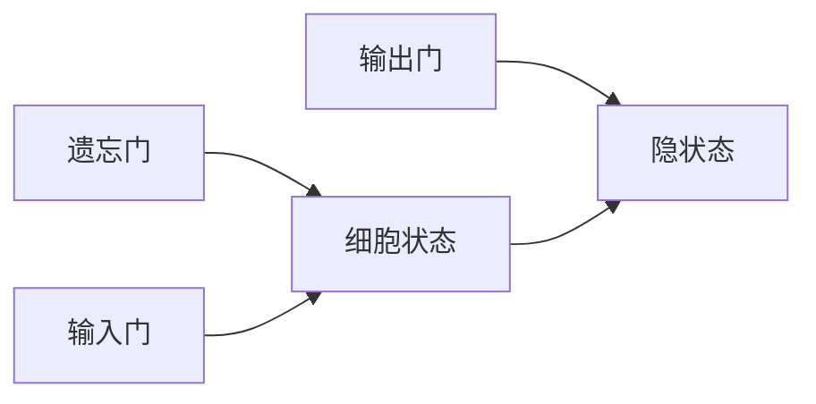

## RNN 与 LSTM

RNN 处理序列数据，核心是**隐状态在时间步之间传递**。



### 简单 RNN

$$
h_t = \tanh(W_h h_{t-1} + W_x x_t + b)
$$

```python
import torch
import torch.nn as nn

rnn = nn.RNN(input_size=128, hidden_size=256, batch_first=True)
x = torch.randn(2, 10, 128)  # (batch=2, seq_len=10, features=128)
output, hidden = rnn(x)
print(f"输出: {output.shape}, 隐状态: {hidden.shape}")
```

### LSTM：解决长距离依赖

LSTM 通过**三个门**控制信息流动：



| 门 | 作用 |
|----|------|
| 遗忘门 | 决定丢弃哪些旧信息 |
| 输入门 | 决定存储哪些新信息 |
| 输出门 | 决定输出什么 |

```python
lstm = nn.LSTM(input_size=128, hidden_size=256, batch_first=True)
output, (hidden, cell) = lstm(x)
print(f"输出: {output.shape}, 隐状态: {hidden.shape}, 细胞状态: {cell.shape}")
```

### RNN → Transformer

RNN 的局限是**串行计算**。Transformer 用 Self-Attention 替代循环，实现并行计算。

### 下一步

- [Transformer 教程](/tutorials/transformer/) — 取代 RNN 的现代架构