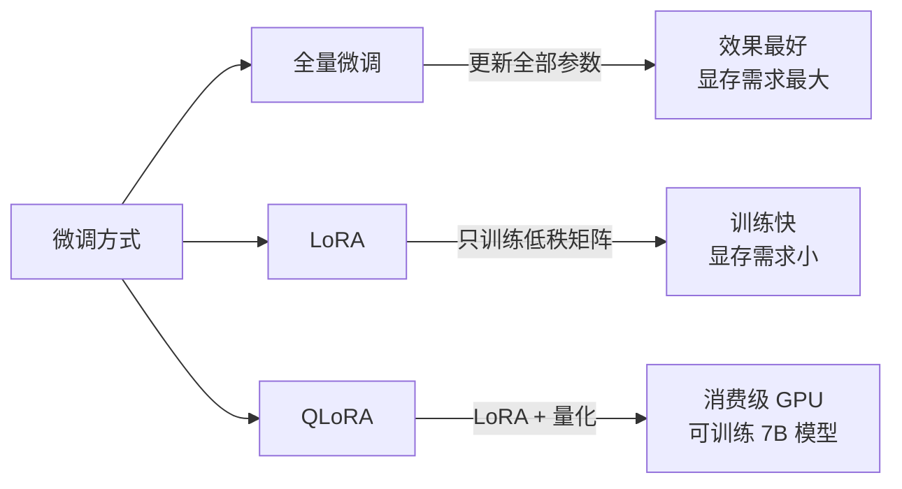

## 微调实战

微调是让预训练大模型适配特定任务的核心技术。不需要从头训练，只需少量数据。

### 三种微调方式



### LoRA：低秩适配

LoRA 不修改原模型权重，而是在旁边训练两个小矩阵 A 和 B：

$$
W' = W + \Delta W = W + BA
$$

其中 $B \in \mathbb{R}^{d \times r}$，$A \in \mathbb{R}^{r \times k}$，$r \ll \min(d, k)$。

```python
from peft import LoraConfig, get_peft_model
from transformers import AutoModelForCausalLM

# 加载模型
model = AutoModelForCausalLM.from_pretrained("meta-llama/Llama-3.2-3B")

# LoRA 配置
lora_config = LoraConfig(
    r=16,              # 低秩维度
    lora_alpha=32,     # 缩放因子
    target_modules=["q_proj", "k_proj", "v_proj", "o_proj"],
    lora_dropout=0.1,
    bias="none",
    task_type="CAUSAL_LM",
)

# 添加 LoRA 适配器
model = get_peft_model(model, lora_config)
model.print_trainable_parameters()
# 输出: trainable params: 8.4M || all params: 3.2B || trainable%: 0.26%
```

### QLoRA：消费级 GPU 微调

QLoRA 在 LoRA 基础上加了 4-bit 量化，让 7B 模型在 12GB 显存上微调：

```python
from transformers import BitsAndBytesConfig
import torch

# 4-bit 量化
bnb_config = BitsAndBytesConfig(
    load_in_4bit=True,
    bnb_4bit_quant_type="nf4",
    bnb_4bit_compute_dtype=torch.bfloat16,
)

model = AutoModelForCausalLM.from_pretrained(
    "meta-llama/Llama-3.2-3B",
    quantization_config=bnb_config,
    device_map="auto",
)

# 加上 LoRA
model = get_peft_model(model, lora_config)
```

### 准备训练数据

```python
from datasets import Dataset

# 对话格式数据
data = [
    {
        "instruction": "解释什么是机器学习",
        "input": "",
        "output": "机器学习是让计算机从数据中学习规律..."
    },
    {
        "instruction": "写一个 Python 排序函数",
        "input": "",
        "output": "def quick_sort(arr):\\n    if len(arr) <= 1:\\n        return arr\\n    ..."
    },
]

def format_example(example):
    text = f"### 指令:\n{example['instruction']}\n\n"
    if example["input"]:
        text += f"### 输入:\n{example['input']}\n\n"
    text += f"### 回答:\n{example['output']}"
    return {"text": text}

dataset = Dataset.from_list(data).map(format_example)
```

### 训练配置

```python
from transformers import TrainingArguments, Trainer

training_args = TrainingArguments(
    output_dir="./lora-llama",
    num_train_epochs=3,
    per_device_train_batch_size=4,
    gradient_accumulation_steps=4,
    learning_rate=2e-4,
    warmup_steps=100,
    logging_steps=10,
    save_strategy="epoch",
    fp16=True,
)

trainer = Trainer(
    model=model,
    args=training_args,
    train_dataset=dataset,
    data_collator=DataCollatorForLanguageModeling(tokenizer, mlm=False),
)
trainer.train()

# 保存 LoRA 权重
model.save_pretrained("./lora-adapter")
```

### 微调方式选择

| 场景 | 推荐方式 | 显存需求 |
|------|---------|---------|
| 7B 模型 + 24GB GPU | LoRA | ~16GB |
| 7B 模型 + 12GB GPU | QLoRA | ~8GB |
| 1B 以下模型 + 大显存 | 全量微调 | 模型 × 4 |
| 快速实验 | QLoRA | 最低 |

### 相关页面

- [大模型原理](/tutorials/llm/) — 理解微调在训练流程中的位置
- [LoRA 概念](/notes/concepts/) — 低秩适配原理