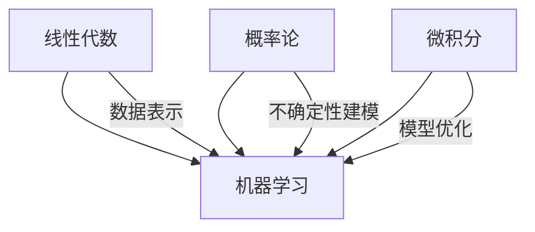

## 数学基础

机器学习本质上是数学。三个核心领域的关系：



### 线性代数：数据的语言

数据在机器学习中表示为**向量和矩阵**。一张图片是一个矩阵，一个 batch 是三维张量，模型的权重也是矩阵。

#### 向量

```python
import numpy as np

v = np.array([1, 2, 3])
u = np.array([4, 5, 6])

# 点积：衡量两个向量的相似度
dot = np.dot(v, u)  # 1×4 + 2×5 + 3×6 = 32
print(f"点积: {dot}")

# 范数：向量的长度
norm = np.linalg.norm(v)  # √(1²+2²+3²) ≈ 3.74
print(f"L2 范数: {norm:.2f}")
```

#### 矩阵运算

```python
A = np.array([[1, 2], [3, 4]])
B = np.array([[5, 6], [7, 8]])

# 矩阵乘法
C = A @ B
print(f"A @ B =\n{C}")

# 转置
print(f"A^T =\n{A.T}")

# 逆矩阵：A⁻¹ 满足 A × A⁻¹ = I
A_inv = np.linalg.inv(A)
print(f"A⁻¹ × A =\n{A_inv @ A}")  # 单位矩阵
```

#### 特征值与特征向量

$$
A v = \lambda v
$$

矩阵 $A$ 乘以向量 $v$ 等于向量 $v$ 缩放 $\lambda$ 倍。这在 PCA 降维中至关重要：

```python
eigenvalues, eigenvectors = np.linalg.eig(A)
print(f"特征值: {eigenvalues}")
```

### 概率论：不确定性的数学

机器学习处理的是**不确定性**——模型给出的是概率，不是确定的答案。

#### 基本概念

```python
# 概率分布：所有事件的概率之和为 1
p = np.array([0.2, 0.3, 0.5])  # 三个事件

# 期望值：加权平均
x = np.array([1, 2, 3])
expectation = np.sum(p * x)
print(f"期望值: {expectation}")  # 0.2×1 + 0.3×2 + 0.5×3 = 2.3
```

#### 正态分布

机器学习中最常见的分布。中心极限定理保证**大量独立随机变量的均值趋近于正态分布**：

$$
f(x) = \frac{1}{\sigma\sqrt{2\pi}} \exp\left(-\frac{(x-\mu)^2}{2\sigma^2}\right)
$$

```python
import matplotlib.pyplot as plt

x = np.linspace(-4, 4, 100)
y = (1 / np.sqrt(2 * np.pi)) * np.exp(-x**2 / 2)

plt.plot(x, y)
plt.fill_between(x, y, alpha=0.2)
plt.axvline(0, color='red', linestyle='--', label='μ=0')
plt.title('标准正态分布 N(0,1)')
plt.legend()
plt.show()
```

关键性质：
- 68% 的数据落在 $[\mu-\sigma, \mu+\sigma]$
- 95% 的数据落在 $[\mu-2\sigma, \mu+2\sigma]$
- 99.7% 的数据落在 $[\mu-3\sigma, \mu+3\sigma]$

### 微积分：优化的基础

#### 导数

导数 = 函数在某点的**变化率**。梯度下降用导数来确定更新方向：

$$
f'(x) = \lim_{h \to 0} \frac{f(x+h) - f(x)}{h}
$$

```python
# 数值微分
def derivative(f, x, h=1e-6):
    return (f(x + h) - f(x - h)) / (2 * h)

f = lambda x: x**3 + 2*x
print(f"f'(2) = {derivative(f, 2):.4f}")  # 3×2² + 2 = 14
```

#### 梯度

梯度是导数的多维推广——指向函数**增长最快**的方向：

$$
\nabla f = \left[\frac{\partial f}{\partial x_1}, \frac{\partial f}{\partial x_2}, ..., \frac{\partial f}{\partial x_n}\right]
$$

梯度下降沿**负梯度方向**更新参数，逐步逼近最小值：


```python
# 梯度下降：求 f(x) = x² 的最小值
def gradient_descent(f_grad, start, lr=0.1, steps=50):
    x = start
    path = [x]
    for _ in range(steps):
        grad = f_grad(x)
        x = x - lr * grad  # 沿负梯度方向移动
        path.append(x)
    return path

f_grad = lambda x: 2*x  # f(x) = x² 的导数
path = gradient_descent(f_grad, start=5.0)
print(f"起点: {path[0]:.1f} → 终点: {path[-1]:.4f}")
```

### 学习建议

> 💡 **不要先学完数学再看 ML。** 边学机器学习边补数学，哪个概念不懂就查哪个。理解了"为什么需要这个数学工具"之后，学习效率最高。

| 当你不理解... | 去补... |
|-------------|--------|
| 数据怎么表示 | 线性代数 |
| 模型为什么这样预测 | 概率论 |
| 参数怎么更新 | 微积分（链式法则） |

### 下一步

- [机器学习概念](/tutorials/ml-basics/03-ml-concepts/) — 用数学理解机器学习
- [Python 工具链](/tutorials/ml-basics/) — 用代码实践数学