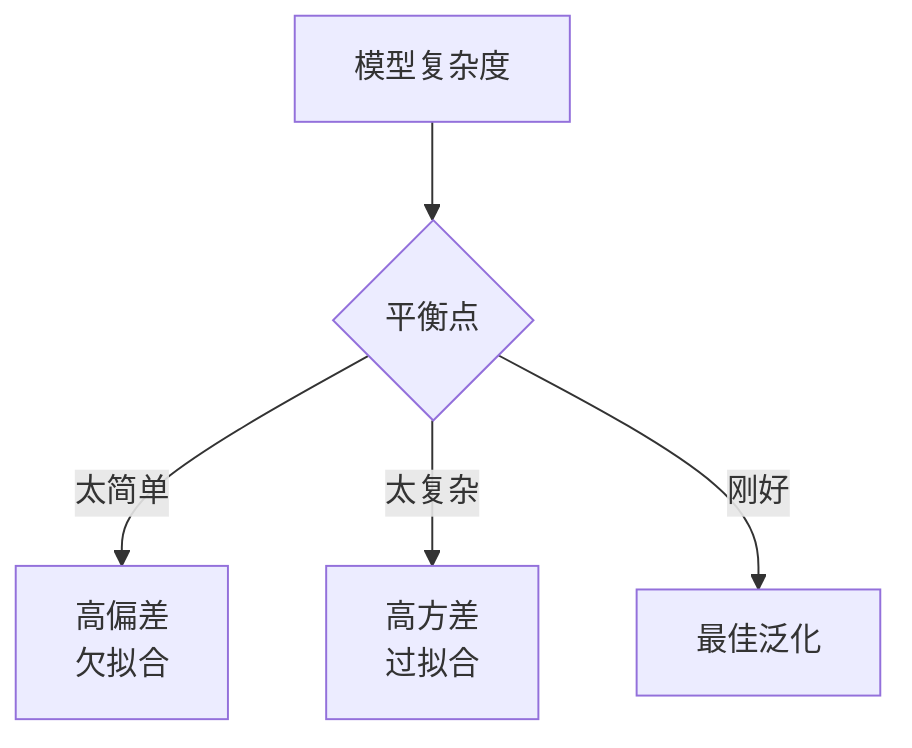
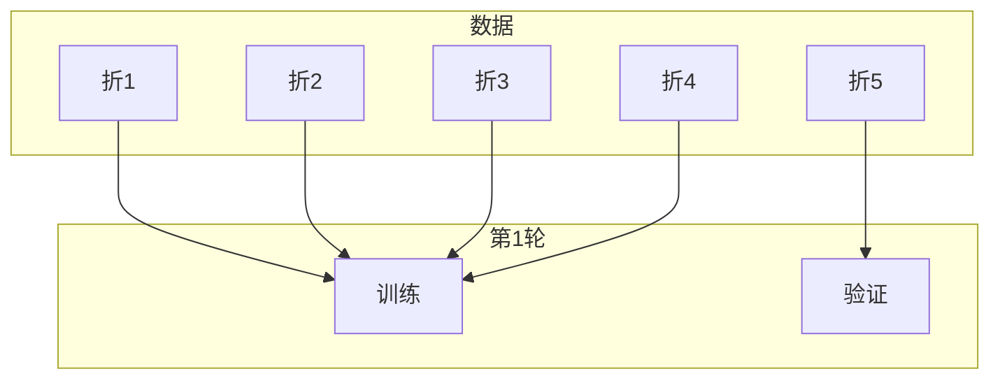

## 机器学习核心概念

机器学习的三要素：**数据**、**模型**、**优化**。


### 三种学习范式

| 范式 | 数据 | 目标 | 生活中的类比 |
|------|------|------|-------------|
| 监督学习 | 有标签 (x, y) | 学习 x→y 的映射 | 有答案的练习题 |
| 无监督学习 | 无标签 (x) | 发现数据结构 | 自己找规律 |
| 强化学习 | 环境交互 | 最大化累积奖励 | 玩游戏学策略 |

#### 监督学习

```python
from sklearn.datasets import make_classification
from sklearn.model_selection import train_test_split
from sklearn.linear_model import LogisticRegression

# 生成分类数据
X, y = make_classification(n_samples=500, n_features=4, random_state=42)

# 划分训练集和测试集
X_train, X_test, y_train, y_test = train_test_split(
    X, y, test_size=0.2, random_state=42
)

# 训练
model = LogisticRegression()
model.fit(X_train, y_train)

# 评估
print(f"训练集准确率: {model.score(X_train, y_train):.3f}")
print(f"测试集准确率: {model.score(X_test, y_test):.3f}")
```

#### 无监督学习

```python
from sklearn.cluster import KMeans
from sklearn.datasets import make_blobs

# 生成聚类数据
X, _ = make_blobs(n_samples=300, centers=3, random_state=42)

# K-Means 聚类
kmeans = KMeans(n_clusters=3, random_state=42)
labels = kmeans.fit_predict(X)

print(f"聚类中心坐标:\n{kmeans.cluster_centers_}")
```

### 偏差-方差权衡

这是机器学习中最核心的概念之一：



$$
\text{期望误差} = \underbrace{(\text{偏差})^2}_{\text{模型能力不足}} + \underbrace{\text{方差}}_{\text{对训练数据过敏感}} + \underbrace{\text{不可约误差}}_{\text{数据本身的噪声}}
$$

#### 过拟合 vs 欠拟合

```python
import numpy as np
from sklearn.preprocessing import PolynomialFeatures
from sklearn.linear_model import LinearRegression
from sklearn.pipeline import make_pipeline

np.random.seed(42)
X = np.linspace(0, 10, 20).reshape(-1, 1)
y = np.sin(X).ravel() + np.random.randn(20) * 0.2

# 欠拟合：一次多项式——模型太简单
model1 = make_pipeline(PolynomialFeatures(1), LinearRegression())
model1.fit(X, y)
print(f"线性 (欠拟合): R² = {model1.score(X, y):.3f}")

# 过拟合：15 次多项式——模型太复杂
model15 = make_pipeline(PolynomialFeatures(15), LinearRegression())
model15.fit(X, y)
print(f"15 次 (过拟合): R² = {model15.score(X, y):.3f}")

# 适中：3 次多项式
model3 = make_pipeline(PolynomialFeatures(3), LinearRegression())
model3.fit(X, y)
print(f"3 次 (适中): R² = {model3.score(X, y):.3f}")
```

### 交叉验证

数据量小时，单次划分不可靠。K 折交叉验证多次评估：



```python
from sklearn.model_selection import cross_val_score

scores = cross_val_score(LogisticRegression(), X, y, cv=5)
print(f"5 折交叉验证: {scores}")
print(f"平均准确率: {scores.mean():.3f} ± {scores.std():.3f}")
```

### 评估指标

#### 混淆矩阵

```
                预测为正    预测为负
实际为正          TP          FN       ← 漏报
实际为负          FP          TN
                  ↑
                误报
```

| 指标 | 公式 | 何时用 |
|------|------|--------|
| 准确率 | $\frac{TP+TN}{Total}$ | 类别均衡时 |
| 精确率 | $\frac{TP}{TP+FP}$ | 减少误报（如垃圾邮件检测） |
| 召回率 | $\frac{TP}{TP+FN}$ | 减少漏报（如疾病筛查） |
| F1 | $2\frac{P \cdot R}{P+R}$ | 综合衡量（不均衡数据） |

```python
from sklearn.metrics import classification_report

y_true = [1, 0, 1, 1, 0, 1, 0, 0, 1, 0]
y_pred = [1, 0, 1, 0, 0, 1, 1, 0, 1, 0]

print(classification_report(y_true, y_pred, target_names=["负类", "正类"]))
```

### 下一步

- [经典算法](/tutorials/ml-basics/04-classic-algorithms/) — 实现具体算法
- [模型评估](/tutorials/ml-basics/07-model-evaluation/) — 深入评估方法