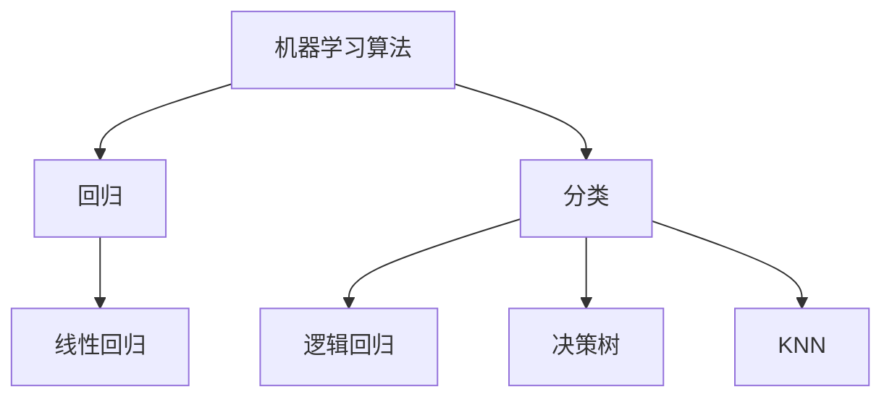
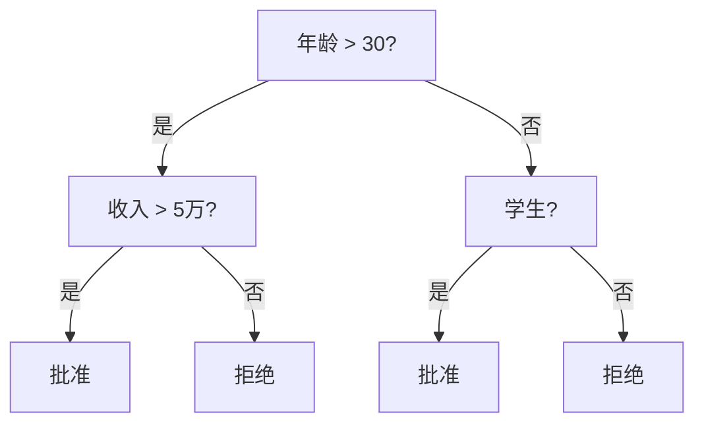

## 经典机器学习算法

机器学习算法虽然很多，但核心思想相通。这里覆盖最常用的四个算法。



### 逻辑回归

名字叫"回归"但用于**分类**。用 Sigmoid 函数将输出映射到 $[0, 1]$，表示概率：

$$
P(y=1|x) = \frac{1}{1 + e^{-(wx+b)}}
$$

```python
from sklearn.linear_model import LogisticRegression
from sklearn.datasets import make_classification

X, y = make_classification(n_samples=200, n_features=4, random_state=42)
model = LogisticRegression()
model.fit(X, y)

print(f"准确率: {model.score(X, y):.3f}")
# predict_proba 返回每个类别的概率
print(f"前 3 个样本的预测概率:\n{model.predict_proba(X[:3])}")
```

### 决策树

通过递归分裂数据，构建树形决策规则。每个节点问一个问题，根据答案走向不同分支：



```python
from sklearn.tree import DecisionTreeClassifier, export_text

model = DecisionTreeClassifier(max_depth=3, random_state=42)
model.fit(X, y)

# 打印决策规则
print(export_text(model))
```

### KNN：K 近邻

最简单的分类算法——新样本的类别由最近的 K 个邻居投票决定：

```python
from sklearn.neighbors import KNeighborsClassifier

model = KNeighborsClassifier(n_neighbors=5)
model.fit(X, y)
print(f"准确率: {model.score(X, y):.3f}")
```

### 算法选择指南

| 场景 | 推荐算法 | 原因 |
|------|---------|------|
| 数据量大、特征多 | 逻辑回归 | 简单高效，可解释 |
| 需要可解释的规则 | 决策树 | 可视化决策过程 |
| 数据量小、无假设 | KNN | 不需要训练 |
| 非线性关系 | 决策树 | 天然处理非线性 |
| 需要概率输出 | 逻辑回归 | 输出是概率 |

### 下一步

- [线性回归与梯度下降](/tutorials/ml-basics/05-linear-regression/) — 深入理解回归
- [特征工程](/tutorials/ml-basics/06-feature-engineering/) — 优化特征