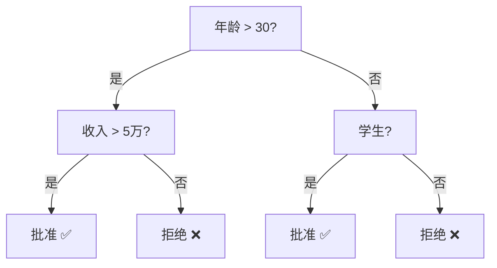

## 经典机器学习算法

### 逻辑回归：名字叫回归，实际做分类

用 Sigmoid 将线性输出映射为概率：

$$
P(y=1|x) = \frac{1}{1 + e^{-(w^Tx + b)}}
$$

```python
from sklearn.linear_model import LogisticRegression
from sklearn.datasets import make_classification

X, y = make_classification(n_samples=200, n_features=4, random_state=42)
model = LogisticRegression()
model.fit(X, y)

print(f"准确率: {model.score(X, y):.3f}")
# predict_proba 返回每个类别的概率
probs = model.predict_proba(X[:3])
print(f"前 3 个样本的概率:\n{probs}")
```

**决策边界**：逻辑回归学习的是线性决策边界。对于非线性问题，需要使用多项式特征或核方法。

### 决策树：可解释的规则

通过递归分裂数据，每次选择最优特征和阈值，构建树形决策规则：



```python
from sklearn.tree import DecisionTreeClassifier, export_text

model = DecisionTreeClassifier(max_depth=3, random_state=42)
model.fit(X, y)

# 打印决策规则
print(export_text(model, feature_names=[f"特征{i}" for i in range(4)]))
```

**关键参数**：
- `max_depth`：最大深度，防止过拟合
- `min_samples_split`：节点最少样本数才分裂
- `criterion`：`gini`（基尼系数）或 `entropy`（信息增益）

### KNN：最懒的算法

KNN 不做任何训练，预测时找最近的 K 个邻居投票：

```python
from sklearn.neighbors import KNeighborsClassifier

model = KNeighborsClassifier(n_neighbors=5)
model.fit(X, y)
print(f"准确率: {model.score(X, y):.3f}")
```

**K 值选择**：
- K 太小 → 对噪声敏感，过拟合
- K 太大 → 决策边界过于平滑，欠拟合
- 常用 $K = \sqrt{n}$ 或交叉验证选择

### 三算法对比

| 算法 | 优点 | 缺点 | 适用场景 |
|------|------|------|---------|
| 逻辑回归 | 可解释、训练快 | 只能线性分类 | 基线模型、文本分类 |
| 决策树 | 可解释、无需缩放 | 容易过拟合 | 需要解释的场景 |
| KNN | 无需训练、简单 | 推理慢、内存大 | 小数据集、推荐系统 |

### 相关页面

- [线性回归](/tutorials/ml-basics/05-linear-regression/) — 回归问题
- [模型评估](/tutorials/ml-basics/07-model-evaluation/) — 如何评价这些算法