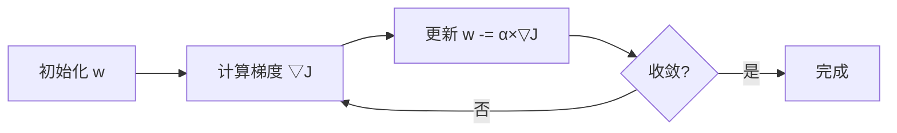

## 线性回归

线性回归是最简单的机器学习算法，但**包含了所有核心概念**：模型、损失、优化。

### 模型定义

假设目标值 $y$ 是特征 $x$ 的线性组合：

$$
\hat{y} = w_0 + w_1x_1 + w_2x_2 + \cdots + w_nx_n = Xw
$$

### 损失函数：MSE

衡量预测值与真实值的差距：

$$
J(w) = \frac{1}{m}\sum_{i=1}^{m}(\hat{y}^{(i)} - y^{(i)})^2
$$

### 方法一：解析解

令梯度为零，直接求解（适合小数据集）：

$$
w = (X^TX)^{-1}X^Ty
$$

```python
import numpy as np

np.random.seed(42)
X = np.random.rand(100, 1) * 10
y = 3 * X.ravel() + 2 + np.random.randn(100) * 2

X_b = np.c_[np.ones((len(X), 1)), X]
w = np.linalg.inv(X_b.T @ X_b) @ X_b.T @ y
print(f"w0(偏置) = {w[0]:.2f}, w1(斜率) = {w[1]:.2f}")
```

### 方法二：梯度下降

当特征很多时，逐步更新参数：

$$
w := w - \alpha \nabla J(w), \quad \nabla J(w) = \frac{2}{m}X^T(Xw - y)
$$



```python
def gradient_descent(X, y, lr=0.01, epochs=1000):
    m, n = X.shape
    w = np.zeros(n)
    for epoch in range(epochs):
        y_pred = X @ w
        grad = (2 / m) * X.T @ (y_pred - y)
        w -= lr * grad
        if epoch % 200 == 0:
            loss = np.mean((y_pred - y) ** 2)
            print(f"Epoch {epoch:4d}: loss = {loss:.4f}")
    return w

X_std = (X - X.mean()) / X.std()
X_b_std = np.c_[np.ones((len(X_std), 1)), X_std]
w_gd = gradient_descent(X_b_std, y, lr=0.1, epochs=1000)
```

### 学习率的影响

```python
import matplotlib.pyplot as plt

for lr in [0.001, 0.01, 0.1, 0.5]:
    w = np.zeros(2)
    losses = []
    for _ in range(100):
        y_pred = X_b_std @ w
        grad = (2/len(X)) * X_b_std.T @ (y_pred - y)
        w -= lr * grad
        losses.append(np.mean((y_pred - y)**2))
    plt.plot(losses, label=f'lr={lr}')
plt.xlabel('Epoch'); plt.ylabel('Loss')
plt.legend(); plt.yscale('log')
plt.show()
```

| 学习率 | 效果 |
|--------|------|
| 太大 | 跳过最优点，震荡甚至发散 |
| 太小 | 收敛太慢 |
| 适中 | 快速稳定收敛 |

### 三种梯度下降

| 类型 | 每步数据量 | 特点 |
|------|-----------|------|
| 批量 | 全部数据 | 最稳定，但每步都慢 |
| 随机 (SGD) | 1 条 | 最快，但振荡 |
| 小批量 | 32-256 条 | **折中最优，实际最常用** |

### 下一步

- [特征工程](/tutorials/ml-basics/06-feature-engineering/) — 处理特征
- [模型评估](/tutorials/ml-basics/07-model-evaluation/) — 评估效果