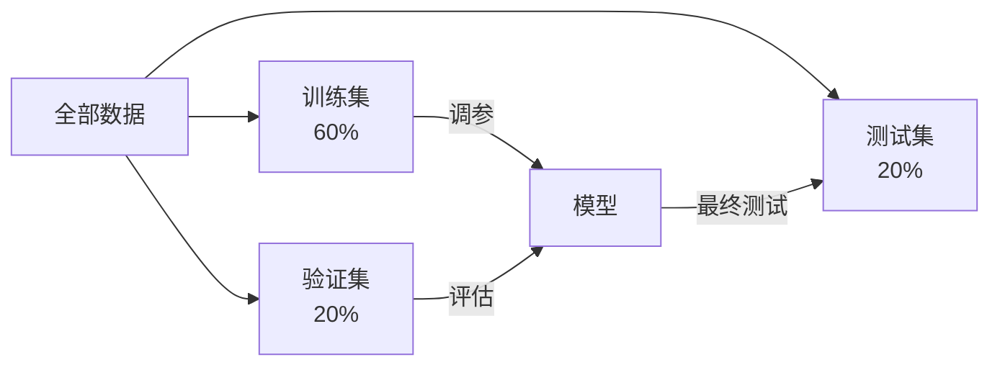

## 模型评估

模型训练完，真正的问题才开始：**它到底好不好？**

### 数据划分策略



```python
from sklearn.model_selection import train_test_split

X_temp, X_test, y_temp, y_test = train_test_split(X, y, test_size=0.2)
X_train, X_val, y_train, y_val = train_test_split(X_temp, y_temp, test_size=0.25)
print(f"训练:{len(X_train)} 验证:{len(X_val)} 测试:{len(X_test)}")
```

### 交叉验证

数据量小时，K 折交叉验证更可靠：

```python
from sklearn.model_selection import cross_val_score

scores = cross_val_score(LogisticRegression(), X, y, cv=5)
print(f"每折: {scores}")
print(f"平均: {scores.mean():.3f} ± {scores.std():.3f}")
```

### 混淆矩阵

```
                预测正    预测负
实际正           TP        FN    ← 漏报（假阴性）
实际负           FP        TN
                 ↑
              误报（假阳性）
```

```python
from sklearn.metrics import confusion_matrix, classification_report

y_true = [1, 0, 1, 1, 0, 1, 0, 0, 1, 0]
y_pred = [1, 0, 1, 0, 0, 1, 1, 0, 1, 0]

print(confusion_matrix(y_true, y_pred))
print(classification_report(y_true, y_pred))
```

### 指标选择指南

| 场景 | 指标 | 原因 |
|------|------|------|
| 均衡分类 | 准确率 | 简单直观 |
| 垃圾邮件检测 | 精确率 | 不想误删正常邮件 |
| 疾病筛查 | 召回率 | 不想漏诊 |
| 不均衡数据 | F1 / AUC | 综合考虑 |
| 回归任务 | R² / MSE | 衡量拟合程度 |

### ROC 与 AUC

```python
from sklearn.metrics import roc_auc_score

y_score = model.predict_proba(X_test)[:, 1]
auc = roc_auc_score(y_test, y_score)
print(f"AUC: {auc:.3f}")
# 1.0 = 完美  0.5 = 随机  <0.5 = 比随机还差
```

### 回归评估

```python
from sklearn.metrics import mean_squared_error, r2_score

y_true = [3.0, -0.5, 2.0, 7.0]
y_pred = [2.5, 0.0, 2.0, 8.0]

print(f"MSE: {mean_squared_error(y_true, y_pred):.3f}")
print(f"R²:  {r2_score(y_true, y_pred):.3f}")
```

### 下一步

- [深度学习入门](/tutorials/deep-learning/) — 进入神经网络