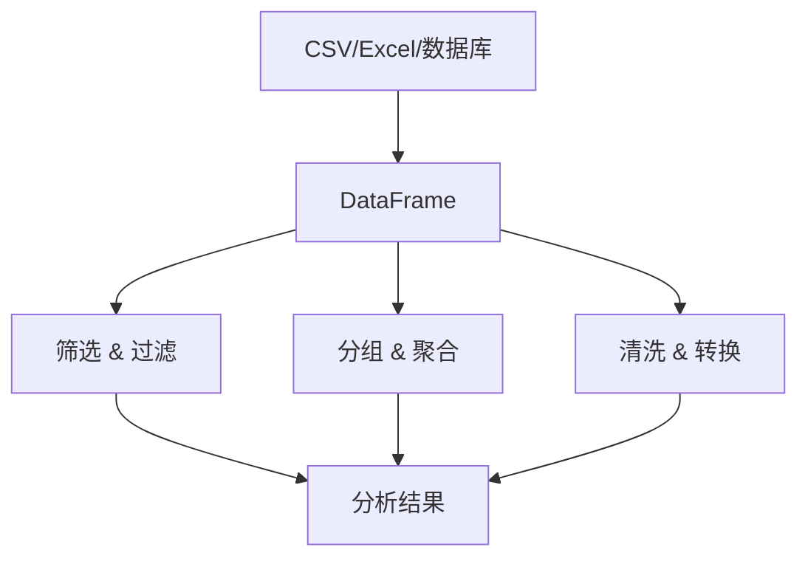
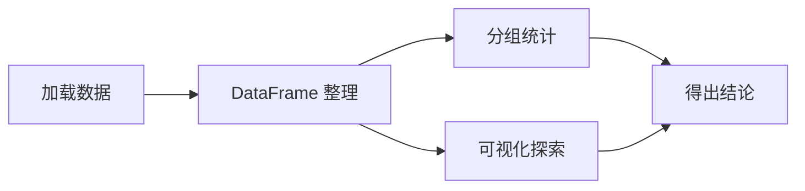

## Python 机器学习工具链

Python 是 AI 开发的主流语言。机器学习的数据处理流程可以概括为：


三个库各司其职：**NumPy** 负责底层数值运算，**Pandas** 负责表格化数据整理，**Matplotlib** 负责可视化。

### NumPy：数值计算基石

NumPy 的核心是 `ndarray`——多维数组。和 Python 列表的区别：

| 特性 | Python 列表 | NumPy 数组 |
|------|------------|-----------|
| 元素类型 | 可以混合 | 必须统一 |
| 内存布局 | 分散存储 | 连续存储 |
| 运算速度 | 慢（循环） | 快（向量化） |
| 数学运算 | 需要手动写 | 内置支持 |

```python
import numpy as np

# 创建数组的 6 种方式
a = np.array([1, 2, 3, 4, 5])          # 从列表创建
b = np.zeros((3, 4))                     # 全零矩阵
c = np.ones((2, 3))                      # 全一矩阵
d = np.eye(3)                            # 单位矩阵
e = np.arange(0, 10, 2)                  # 等差数列 [0, 2, 4, 6, 8]
f = np.linspace(0, 1, 5)                 # 等间距 5 个点
g = np.random.randn(3, 3)                # 标准正态分布随机矩阵

# 查看数组属性
print(f"形状: {a.shape}, 维度: {a.ndim}, 元素类型: {a.dtype}")
```

#### 索引与切片

NumPy 的切片是**视图**而非拷贝——修改切片会影响原数组，这是性能优化的关键设计。

```python
arr = np.array([[1, 2, 3],
                [4, 5, 6],
                [7, 8, 9]])

print(arr[0, 0])      # 1 — 单个元素
print(arr[0, :])      # [1, 2, 3] — 第一行
print(arr[:, 1])      # [2, 5, 8] — 第二列
print(arr[1:, :2])    # [[4,5],[7,8]] — 子矩阵（后两行，前两列）

# 布尔索引：筛选满足条件的元素
mask = arr > 5
print(arr[mask])      # [6, 7, 8, 9] — 所有大于 5 的元素
```

#### 广播机制

广播是 NumPy 最强大的特性之一。当两个形状不同的数组运算时，NumPy 自动扩展较小的数组：

```python
a = np.array([[1, 2, 3],
              [4, 5, 6]])   # 形状: (2, 3)
b = np.array([10, 20, 30])  # 形状: (3,)

# b 自动"广播"为 (2, 3)：
# [[10, 20, 30],
#  [10, 20, 30]]
print(a + b)
# [[11, 22, 33],
#  [14, 25, 36]]
```

广播规则：从最后一维开始对齐，维度为 1 或缺失的维度会被扩展。

#### 常用运算

```python
x = np.array([1, 2, 3, 4, 5])

# 统计运算
print(np.mean(x))    # 3.0 — 均值
print(np.std(x))     # 1.41 — 标准差
print(np.min(x))     # 1 — 最小值
print(np.argmax(x))  # 4 — 最大值所在的索引

# 线性代数
A = np.array([[1, 2], [3, 4]])
B = np.array([[5, 6], [7, 8]])
print(A @ B)                    # 矩阵乘法
print(np.linalg.inv(A))         # 逆矩阵

# 变形
print(x.reshape(5, 1))          # (5,) → (5, 1)，增加一个维度
print(x[:, np.newaxis])         # 同上，另一种写法
```

### Pandas：数据处理

Pandas 的核心是 `DataFrame`——可以理解为"Python 中的 Excel 表格"。



#### 创建和查看数据

```python
import pandas as pd

df = pd.DataFrame({
    "name":   ["Alice", "Bob", "Charlie", "Diana"],
    "age":    [25, 30, 35, 28],
    "salary": [50000, 60000, 80000, 55000],
    "dept":   ["HR", "Eng", "Eng", "HR"],
})

print(df.head(2))       # 查看前两行
print(df.shape)         # (4, 4) — 行数和列数
print(df.dtypes)        # 每列的数据类型
print(df.describe())    # 数值列的统计摘要（均值、标准差、四分位数等）
```

#### 数据筛选

```python
# 单条件：年龄大于 28
print(df[df["age"] > 28])

# 多条件：年龄大于 28 且属于工程部
print(df[(df["age"] > 28) & (df["dept"] == "Eng")])

# 按标签选择（loc）vs 按位置选择（iloc）
print(df.loc[0:2, "name":"salary"])   # 按行标签和列标签
print(df.iloc[0:2, 1:3])              # 按行位置和列位置
```

#### 分组聚合

```python
# 按部门统计平均薪资
print(df.groupby("dept")["salary"].mean())

# 多指标聚合
print(df.groupby("dept").agg({
    "salary": ["mean", "max", "count"],
    "age": "mean",
}))
# 输出：
#             salary              age
#              mean    max count mean
# dept
# Eng        70000.0  80000     2 32.5
# HR         52500.0  55000     2 26.5
```

#### 数据清洗

```python
# 缺失值处理
df2 = pd.DataFrame({"a": [1, None, 3], "b": [4, 5, None]})
print(df2.isnull().sum())    # 统计每列缺失值数量
df2 = df2.fillna(0)          # 用 0 填充缺失值

# 去重
df = df.drop_duplicates()

# 类型转换
df["age"] = df["age"].astype(float)

# 重命名列
df = df.rename(columns={"dept": "department"})
```

### Matplotlib：可视化

数据可视化是理解数据最直接的方式。

```python
import matplotlib.pyplot as plt

# 折线图
x = np.linspace(0, 10, 100)
plt.plot(x, np.sin(x), label="sin(x)")
plt.plot(x, np.cos(x), label="cos(x)")
plt.xlabel("x")
plt.ylabel("y")
plt.title("sin and cos")
plt.legend()
plt.grid(True, alpha=0.3)
plt.show()

# 散点图
x = np.random.randn(100)
y = 2 * x + np.random.randn(100) * 0.5
plt.scatter(x, y, alpha=0.6, c=np.abs(x), cmap="viridis")
plt.colorbar(label="|x|")
plt.show()

# 直方图
data = np.random.randn(1000)
plt.hist(data, bins=30, edgecolor="white", alpha=0.7)
plt.axvline(data.mean(), color="red", linestyle="--",
            label=f"均值={data.mean():.2f}")
plt.legend()
plt.show()
```

### 实战：鸢尾花数据集分析

把三个库串起来，完成一个完整的分析流程：



```python
from sklearn.datasets import load_iris
import pandas as pd
import matplotlib.pyplot as plt

# 1. 加载数据
iris = load_iris()
df = pd.DataFrame(iris.data, columns=iris.feature_names)
df["species"] = iris.target

# 2. 数据概览：每个物种各特征的平均值
print(df.groupby("species").mean())

# 3. 可视化：不同物种的特征分布
fig, axes = plt.subplots(1, 3, figsize=(12, 4))
for i, feature in enumerate(iris.feature_names[:3]):
    for species in range(3):
        subset = df[df["species"] == species]
        axes[i].hist(subset[feature], alpha=0.5,
                     label=iris.target_names[species], bins=15)
    axes[i].set_title(feature)
    axes[i].legend(fontsize=7)
plt.tight_layout()
plt.show()
```

### 总结

```
NumPy  → 数值计算、矩阵运算（底层）
Pandas → 数据整理、统计分析（中层）
Matplotlib → 数据可视化（上层）
```

三个库配合使用，构成了 Python 数据分析的完整工具链。

### 下一步

- [数学基础](/tutorials/ml-basics/02-math-basics/) — 线性代数、概率论、微积分
- [机器学习概念](/tutorials/ml-basics/03-ml-concepts/) — 进入机器学习