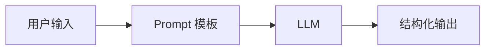

## 什么是 Prompt Engineering？

Prompt Engineering 是**设计输入文本以引导大模型生成期望输出**的技术。不改变模型参数，只优化输入。



### 提示词结构

```
[角色] 你是一个 AI 技术专家。
[任务] 用通俗语言解释以下概念。
[格式] 1)一句话总结 2)一个类比 3)一个示例
[输入] 概念：注意力机制
```

### 基础原则

1. **清晰明确**：告诉模型要做什么、怎么做、输出什么格式
2. **提供上下文**：相关背景信息越多，输出越准确
3. **给出示例**：Few-shot 远比 Zero-shot 效果好

### 提示词的基本结构

```
[角色设定] 你是一个专业的 AI 技术文档撰写者。
[任务描述] 请用通俗易懂的语言解释以下概念。
[格式要求] 输出格式：1) 一句话总结 2) 一个类比 3) 一个代码示例
[输入内容] 概念：注意力机制
```

### 关键技巧

#### Zero-shot：直接提问

```
请列举 Python 中常用的 5 个内置函数，并说明用途。
```

#### Few-shot：给出示例

```
将英文翻译成中文：

English: Hello, how are you?
中文: 你好，你怎么样？

English: I love machine learning.
中文: 我热爱机器学习。

English: The weather is beautiful today.
中文:
```

#### Chain-of-Thought：引导推理

```
问题：一个农场有 15 只鸡和 8 只兔子，一共有多少条腿？

让我们一步步思考：
1. 鸡有 2 条腿，15 只鸡 → 15 × 2 = 30 条腿
2. 兔子有 4 条腿，8 只兔子 → 8 × 4 = 32 条腿
3. 总共：30 + 32 = 62 条腿

答案：62 条腿
```

### 代码实现

```python
from openai import OpenAI

client = OpenAI()

def ask(prompt, system="你是一个有用的助手。"):
    response = client.chat.completions.create(
        model="gpt-4o",
        messages=[
            {"role": "system", "content": system},
            {"role": "user", "content": prompt},
        ],
        temperature=0.7,
    )
    return response.choices[0].message.content

# Few-shot 示例
result = ask("""
将以下句子分类为"正面"或"负面"：

例句：这个产品质量很好。→ 正面
例句：服务态度太差了。→ 负面
例句：物流速度挺快的，包装也很完整。→
""")
print(result)  # 正面
```

### 常见陷阱

| 陷阱 | 表现 | 解决 |
|------|------|------|
| 幻觉 | 编造不存在的事实 | 要求引用来源 |
| 指令遗忘 | 长对话中忽略早期指令 | 在结尾重复关键要求 |
| 格式错误 | 输出格式不符合要求 | 用 JSON schema 约束 |

### 高级技巧

#### 结构化输出

```python
from openai import OpenAI
client = OpenAI()

response = client.chat.completions.create(
    model="gpt-4o",
    messages=[{"role": "user", "content": "列出 3 本 AI 书籍"}],
    response_format={
        "type": "json_schema",
        "json_schema": {
            "name": "books",
            "schema": {
                "type": "object",
                "properties": {
                    "books": {
                        "type": "array",
                        "items": {
                            "type": "object",
                            "properties": {
                                "title": {"type": "string"},
                                "author": {"type": "string"},
                                "year": {"type": "integer"},
                            },
                        },
                    },
                },
            },
        },
    },
)
print(response.choices[0].message.content)
```

#### 自洽性（Self-Consistency）

同一问题多次采样，取多数答案：

```python
def self_consistency(prompt, n=5):
    answers = []
    for _ in range(n):
        response = client.chat.completions.create(
            model="gpt-4o",
            messages=[{"role": "user", "content": prompt}],
            temperature=0.7,  # 非零温度产生多样性
        )
        answers.append(response.choices[0].message.content)
    # 取出现最多的答案
    from collections import Counter
    return Counter(answers).most_common(1)[0][0]
```

#### Tree of Thoughts

让模型探索多条推理路径，选择最优：

```
问题: 如何用 3 升和 5 升的桶量出 4 升水？

思路 1: 装满 5 升 → 倒入 3 升 → 5 升桶剩 2 升 → ...
思路 2: 装满 3 升 → 倒入 5 升 → 再装满 3 升 → ...
思路 3: ...

评估: 思路 1 最短，思路 2 也能达到...
最佳: 思路 1
```

### 相关页面

- [大模型原理](/tutorials/llm/) — 理解模型为什么会对 prompt 做出反应
- [RAG 与 Agent](/tutorials/rag-agent/) — 将 prompt 工程应用于实际应用