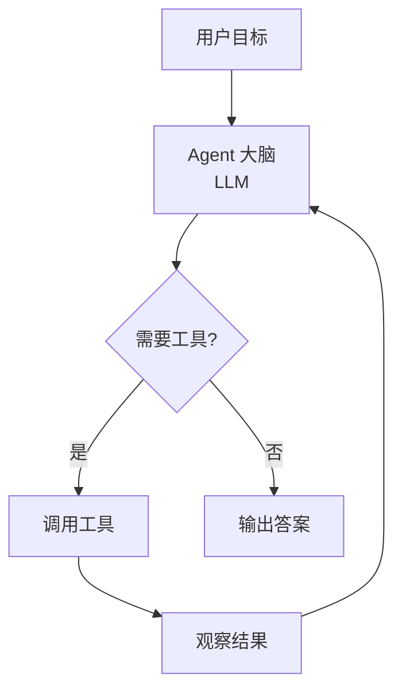
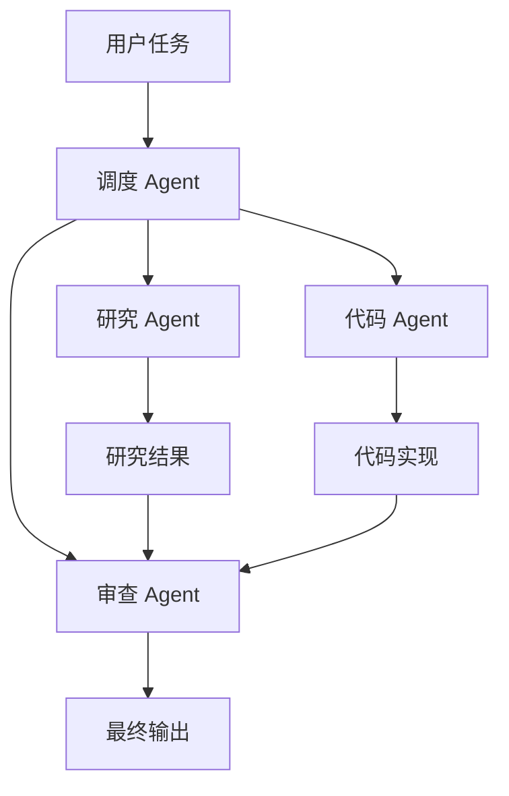

## Agent 开发实战

Agent 不是被动回答问题，而是**主动规划、调用工具、多步推理**的智能体。



### Agent 的核心循环

```python
class Agent:
    def __init__(self, llm, tools):
        self.llm = llm
        self.tools = {t.name: t for t in tools}
        self.memory = []  # 对话历史

    def run(self, task, max_steps=10):
        self.memory.append({"role": "user", "content": task})

        for step in range(max_steps):
            response = self.llm.chat(self.memory, list(self.tools.values()))

            if response.tool_calls:
                # 执行工具调用
                for call in response.tool_calls:
                    result = self.tools[call.name].execute(call.args)
                    self.memory.append({
                        "role": "tool",
                        "tool_call_id": call.id,
                        "content": str(result),
                    })
            else:
                # 直接回答
                return response.content

        return "达到最大步数限制"
```

### 工具定义

工具是 Agent 的"手脚"，让 LLM 能与外部世界交互：

```python
from pydantic import BaseModel

class SearchTool:
    name = "search_web"
    description = "搜索互联网获取最新信息"

    class Args(BaseModel):
        query: str

    def execute(self, args):
        # 实际调用搜索 API
        return f"搜索结果: 关于'{args.query}'的信息..."

class Calculator:
    name = "calculate"
    description = "执行数学计算"

    class Args(BaseModel):
        expression: str

    def execute(self, args):
        return eval(args.expression)
```

### ReAct 模式：推理 + 行动

ReAct（Reasoning + Acting）是 Agent 最常用的模式：

```
思考: 我需要知道今天北京的天气，然后决定穿什么
行动: search_weather("北京")
观察: 北京今天 25°C，晴
思考: 25°C 是温暖的天气，不需要外套
回答: 今天北京天气晴朗，25°C，建议穿短袖或薄长袖
```

```python
def react_agent(task, llm, tools, max_steps=5):
    prompt = f"""你是一个 AI 助手。请用以下格式回答：

思考: [你的推理过程]
行动: [工具名称]: [参数]
观察: [工具返回结果]
... (可重复)
回答: [最终答案]

可用工具: {[t.name + ': ' + t.description for t in tools]}

用户问题: {task}
"""
    history = prompt
    for _ in range(max_steps):
        response = llm.generate(history)
        if "回答:" in response:
            return response.split("回答:")[-1].strip()
        if "行动:" in response:
            action = parse_action(response)
            result = execute_action(action, tools)
            history += f"\n观察: {result}"
    return response
```

### 记忆系统

Agent 需要记忆来保持上下文和执行多步任务：

| 记忆类型 | 作用 | 实现 |
|----------|------|------|
| 短期记忆 | 当前对话上下文 | 对话历史列表 |
| 长期记忆 | 跨会话的信息 | 向量数据库 |
| 工作记忆 | 中间推理结果 | 临时变量存储 |

```python
class Memory:
    def __init__(self):
        self.short_term = []  # 当前对话

    def add(self, role, content):
        self.short_term.append({"role": role, "content": content})
        # 只保留最近 20 条
        if len(self.short_term) > 20:
            self.short_term = self.short_term[-20:]

    def summarize(self):
        """压缩早期对话为摘要，节省 token"""
        if len(self.short_term) > 10:
            early = self.short_term[:-5]
            summary = summarize_conversation(early)
            self.short_term = [{"role": "system", "content": f"之前对话摘要: {summary}"}] + \
                              self.short_term[-5:]
```

### 多 Agent 协作

复杂任务可以由多个 Agent 分工完成：



```python
class MultiAgent:
    def __init__(self):
        self.researcher = Agent(researcher_llm, [SearchTool()])
        self.coder = Agent(coder_llm, [CodeExecutor()])
        self.reviewer = Agent(reviewer_llm, [])

    def run(self, task):
        # 1. 研究
        research = self.researcher.run(f"研究以下问题: {task}")
        # 2. 编码
        code = self.coder.run(f"根据研究结果实现: {research}")
        # 3. 审查
        review = self.reviewer.run(f"审查以下代码: {code}")
        return review
```

### 常见陷阱与解决

| 陷阱 | 表现 | 解决 |
|------|------|------|
| 无限循环 | Agent 反复调用同一个工具 | 设置 max_steps |
| 幻觉 | 编造不存在的工具结果 | 工具返回明确错误信息 |
| 上下文溢出 | 对话历史超过 token 限制 | 记忆压缩、摘要 |
| 工具滥用 | 简单问题也调用工具 | 提示词中强调"仅在必要时" |

### 相关页面

- [RAG 与 Agent 开发](/tutorials/rag-agent/) — RAG 基础
- [Prompt Engineering](/tutorials/prompt-engineering/) — Agent 的提示词设计
- [模型部署](/tutorials/rag-agent/deployment/) — 部署 Agent 到生产