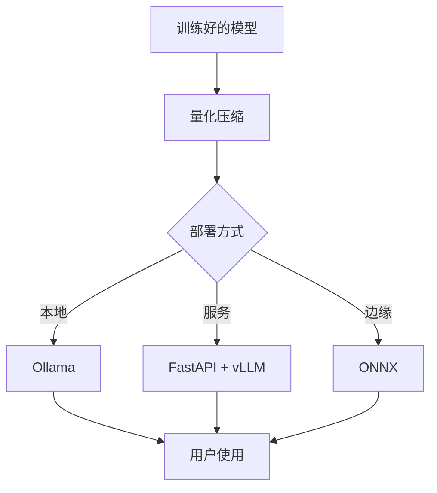

## 模型部署

训练好模型只是第一步，部署到生产环境才是真正的挑战。



### 部署方式对比

| 方式 | 适用场景 | 延迟 | 成本 |
|------|----------|------|------|
| 本地部署 (Ollama) | 个人使用、开发测试 | 低 | 硬件成本 |
| API 服务 (FastAPI) | 小规模服务 | 低 | 服务器 |
| 云端推理 (vLLM) | 大规模生产 | 极低 | 按量付费 |
| 边缘部署 (ONNX) | 移动端、IoT | 极低 | 一次投入 |

### 量化：减小模型体积

把模型参数从 FP16（2 字节）压缩到 INT4（0.5 字节），显存减少 4 倍：

```python
from transformers import AutoModelForCausalLM, BitsAndBytesConfig
import torch

# 4-bit 量化加载
bnb_config = BitsAndBytesConfig(
    load_in_4bit=True,
    bnb_4bit_quant_type="nf4",
    bnb_4bit_compute_dtype=torch.bfloat16,
)

model = AutoModelForCausalLM.from_pretrained(
    "meta-llama/Llama-3.2-3B",
    quantization_config=bnb_config,
    device_map="auto",
)
print(f"显存占用: {model.get_memory_footprint() / 1e9:.1f} GB")
```

### 用 FastAPI 搭建 API 服务

```python
from fastapi import FastAPI
from pydantic import BaseModel
from transformers import pipeline

app = FastAPI()
generator = pipeline("text-generation", model="gpt2")

class Request(BaseModel):
    prompt: str
    max_length: int = 100

class Response(BaseModel):
    text: str

@app.post("/generate", response_model=Response)
def generate(req: Request):
    result = generator(req.prompt, max_length=req.max_length)
    return Response(text=result[0]["generated_text"])

# 启动: uvicorn app:app --host 0.0.0.0 --port 8000
```

### 高性能推理：vLLM

```python
from vllm import LLM, SamplingParams

# 加载模型（自动管理 KV Cache）
llm = LLM(model="meta-llama/Llama-3.2-3B")

prompts = ["Explain quantum computing in simple terms."]
sampling_params = SamplingParams(temperature=0.7, max_tokens=200)

outputs = llm.generate(prompts, sampling_params)
for output in outputs:
    print(output.outputs[0].text)
```

### Ollama：本地运行

```bash
# 安装并拉取模型
ollama pull llama3.2

# 命令行使用
ollama run llama3.2 "什么是 Transformer？"

# 启动 API 服务
ollama serve
```

```python
# Python 调用
import requests

response = requests.post("http://localhost:11434/api/generate", json={
    "model": "llama3.2",
    "prompt": "Explain Transformer in one sentence.",
    "stream": False,
})
print(response.json()["response"])
```

### 部署检查清单

- [ ] 模型量化了吗？
- [ ] 吞吐量（QPS）够吗？
- [ ] 延迟在可接受范围内吗？
- [ ] 显存/内存够吗？
- [ ] 有健康检查和日志吗？
- [ ] 做了压力测试吗？

### 相关页面

- [大模型原理](/tutorials/llm/) — 理解模型的内部机制
- [RAG 与 Agent](/tutorials/rag-agent/) — 基于部署模型的应用开发