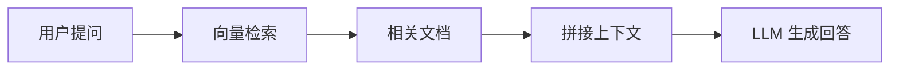

## RAG：检索增强生成

大模型的知识截止于训练数据。RAG 让模型**实时检索外部知识库**。



### RAG 工作流程

```
用户提问 → 检索相关文档 → 拼接上下文 → LLM 生成回答
```

### 从零实现简易 RAG

```python
import chromadb
import numpy as np
from openai import OpenAI

client = OpenAI()
chroma = chromadb.Client()
collection = chroma.create_collection("knowledge")

# 1. 准备知识库
documents = [
    "Transformer 架构由 Vaswani 等人在 2017 年提出。",
    "Attention 机制的核心是 Q、K、V 三个矩阵。",
    "GPT-4 是 OpenAI 在 2023 年发布的多模态模型。",
    "RAG 结合了检索和生成两种技术。",
]
for i, doc in enumerate(documents):
    collection.add(documents=[doc], ids=[str(i)])

# 2. 查询
question = "谁提出了 Transformer？"
results = collection.query(query_texts=[question], n_results=2)

# 3. 拼接上下文
context = "\n".join(results["documents"][0])
prompt = f"""根据以下上下文回答问题。如果上下文不足以回答，请说明。

上下文：
{context}

问题：{question}
回答："""

# 4. 生成
response = client.chat.completions.create(
    model="gpt-4o",
    messages=[{"role": "user", "content": prompt}],
)
print(response.choices[0].message.content)
```

### 文档切分策略

```python
# 按语义切分，保持上下文连贯
text = "长文档..." * 1000

# 固定大小切分
chunk_size = 512
chunk_overlap = 50  # 重叠 50 个字符保持上下文
chunks = [text[i:i+chunk_size] for i in range(0, len(text), chunk_size - chunk_overlap)]

print(f"文档被切分成 {len(chunks)} 个块")
```

### Agent：让模型自主行动

Agent 不是被动回答问题，而是**主动规划、调用工具、多步推理**。

```python
# Agent 的核心循环
def agent_loop(task, tools, max_steps=5):
    conversation = [{"role": "user", "content": task}]

    for step in range(max_steps):
        # 1. 模型决定下一步：回答问题 or 调用工具
        response = client.chat.completions.create(
            model="gpt-4o",
            messages=conversation,
            tools=tools,  # 可用工具列表
        )

        msg = response.choices[0].message

        # 2. 如果模型想调用工具
        if msg.tool_calls:
            for tool_call in msg.tool_calls:
                tool_name = tool_call.function.name
                args = eval(tool_call.function.arguments)

                # 执行工具
                result = execute_tool(tool_name, args)

                # 工具结果加入对话
                conversation.append({
                    "role": "tool",
                    "tool_call_id": tool_call.id,
                    "content": str(result),
                })
        else:
            # 3. 模型直接回答
            return msg.content

    return "达到最大步数限制"


# 工具定义
tools = [
    {
        "type": "function",
        "function": {
            "name": "search_web",
            "description": "搜索互联网获取最新信息",
            "parameters": {
                "type": "object",
                "properties": {
                    "query": {"type": "string"},
                },
            },
        },
    },
    {
        "type": "function",
        "function": {
            "name": "calculate",
            "description": "执行数学计算",
            "parameters": {
                "type": "object",
                "properties": {
                    "expression": {"type": "string"},
                },
            },
        },
    },
]
```

### RAG vs Agent 对比

| 特性 | RAG | Agent |
|------|-----|-------|
| 核心能力 | 检索 + 生成 | 规划 + 工具调用 |
| 适用场景 | 知识问答、文档搜索 | 自动化任务、多步推理 |
| 复杂度 | 较低 | 较高 |
| 典型应用 | 客服机器人、文档助手 | 代码助手、自动化操作 |

### 相关页面

- [大模型原理](/tutorials/llm/) — 理解 RAG 和 Agent 的底层模型
- [Prompt Engineering](/tutorials/prompt-engineering/) — Agent 中提示词的设计
- [工具生态](/notes/tools/) — LangChain、Chroma 等工具