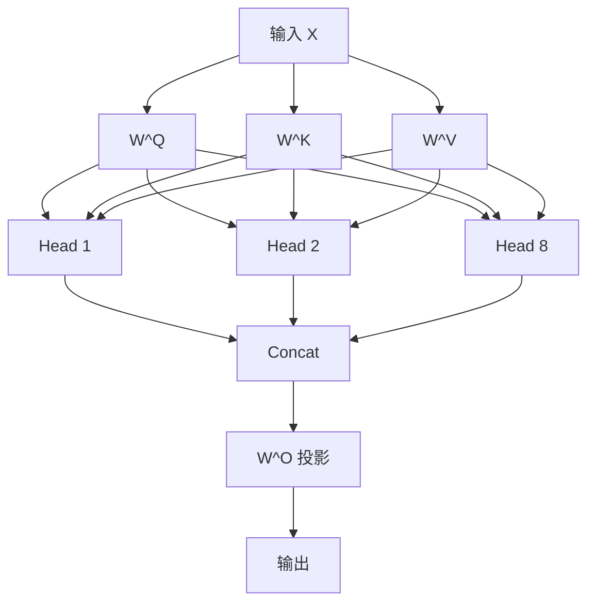

## Multi-Head Attention

单个 Attention 只能捕捉一种词间关系。Multi-Head Attention 让模型**同时关注多种语义关系**。



### 为什么需要多个头？

| 头 | 可能关注的关系 |
|----|--------------|
| Head 1 | 主谓关系（主语 ↔ 谓语动词） |
| Head 2 | 指代关系（代词 ↔ 先行词） |
| Head 3 | 修饰关系（形容词 ↔ 名词） |
| Head 4 | 语义关联（同义词、相关词） |

### 公式

$$
\text{MultiHead}(Q, K, V) = \text{Concat}(\text{head}_1, ..., \text{head}_h)W^O
$$

每个头在低维子空间计算：

$$
\text{head}_i = \text{Attention}(QW_i^Q, KW_i^K, VW_i^V)
$$

其中 $W_i^Q, W_i^K, W_i^V \in \mathbb{R}^{d_{\text{model}} \times d_k}$，$d_k = d_{\text{model}} / h$。

### 完整实现

```python
import torch
import torch.nn as nn
import math

class MultiHeadAttention(nn.Module):
    def __init__(self, d_model=512, n_heads=8):
        super().__init__()
        assert d_model % n_heads == 0
        self.n_heads = n_heads
        self.d_k = d_model // n_heads

        self.W_q = nn.Linear(d_model, d_model)
        self.W_k = nn.Linear(d_model, d_model)
        self.W_v = nn.Linear(d_model, d_model)
        self.W_o = nn.Linear(d_model, d_model)

    def forward(self, x, mask=None):
        B, L, _ = x.shape

        # (B, L, d_model) → (B, n_heads, L, d_k)
        Q = self.W_q(x).view(B, L, self.n_heads, self.d_k).transpose(1, 2)
        K = self.W_k(x).view(B, L, self.n_heads, self.d_k).transpose(1, 2)
        V = self.W_v(x).view(B, L, self.n_heads, self.d_k).transpose(1, 2)

        # Scaled Dot-Product Attention
        scores = (Q @ K.transpose(-2, -1)) / math.sqrt(self.d_k)
        if mask is not None:
            scores = scores.masked_fill(mask == 0, -1e9)
        attn = torch.softmax(scores, dim=-1)
        out = attn @ V

        # 拼接多头
        out = out.transpose(1, 2).contiguous().view(B, L, -1)
        return self.W_o(out), attn


# 测试：8 个头，每个头 64 维
mha = MultiHeadAttention(d_model=512, n_heads=8)
x = torch.randn(2, 10, 512)  # batch=2, seq=10, dim=512
output, weights = mha(x)
print(f"输出: {output.shape}")      # (2, 10, 512)
print(f"注意力权重: {weights.shape}") # (2, 8, 10, 10)
```

### 多头变体：MQA 与 GQA

| 变体 | K、V 共享方式 | 显存占用 | 使用者 |
|------|-------------|----------|--------|
| MHA | 每个头独立 K、V | 最大 | 原始 Transformer |
| MQA | 所有头共享 K、V | 1/h | PaLM、Gemini |
| GQA | 分组共享 K、V | 组数/h | **Llama 2/3** |

GQA 是当前最优折中——在显存和性能之间取得平衡。

### Transformer 的完整参数

原始论文的配置：
- $d_{\text{model}} = 512$，$h = 8$
- $d_k = d_v = 512 / 8 = 64$
- Encoder 6 层，Decoder 6 层

### 下一步

- [4. 位置编码](#) — 让模型知道词的位置
- [Multi-Head Attention 概念卡](/notes/concepts/multi-head-attention/) — 知识库速查