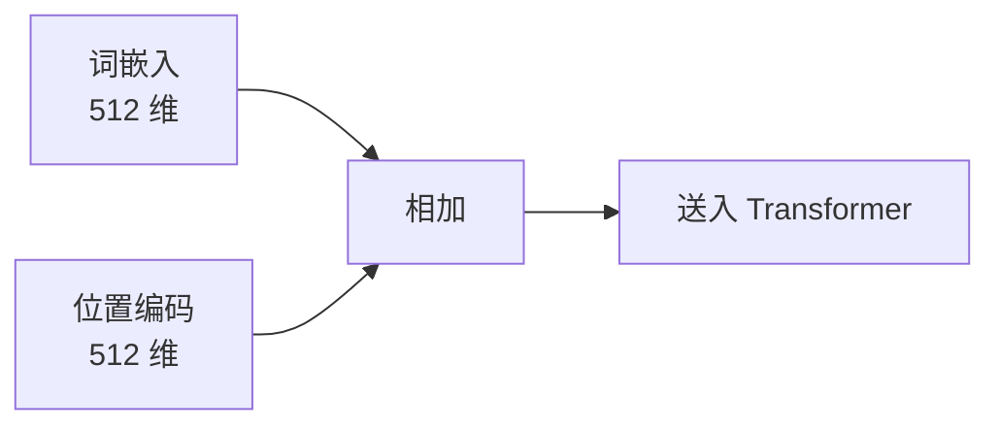

## 位置编码

Transformer 没有循环结构，无法感知词的顺序。位置编码**给每个位置的词加上位置信息**。



### 正弦位置编码

原始 Transformer 使用固定频率的正弦/余弦函数：

$$
PE_{(pos, 2i)} = \sin\left(\frac{pos}{10000^{2i/d_{\text{model}}}}\right)
$$

$$
PE_{(pos, 2i+1)} = \cos\left(\frac{pos}{10000^{2i/d_{\text{model}}}}\right)
$$

```python
import numpy as np
import matplotlib.pyplot as plt

def sinusoidal_encoding(seq_len, d_model):
    pe = np.zeros((seq_len, d_model))
    for pos in range(seq_len):
        for i in range(0, d_model, 2):
            angle = pos / (10000 ** (i / d_model))
            pe[pos, i] = np.sin(angle)
            pe[pos, i + 1] = np.cos(angle)
    return pe

pe = sinusoidal_encoding(50, 128)
plt.imshow(pe.T, aspect='auto', cmap='RdBu')
plt.colorbar()
plt.xlabel('位置'); plt.ylabel('维度')
plt.title('正弦位置编码')
plt.show()
```

### 为什么用正弦函数？

关键性质：位置 $pos + k$ 的编码可以由位置 $pos$ 的编码**线性变换**得到。这让模型能学到相对位置关系。

### RoPE：旋转位置编码

RoPE 是现代大模型（Llama、Qwen、DeepSeek）的标准选择。**通过旋转向量来编码位置信息**：

```python
def apply_rope(x, theta=10000.0):
    """对输入应用旋转位置编码"""
    B, L, H, D = x.shape  # batch, seq, heads, dim
    pos = torch.arange(L, device=x.device).float()

    # 计算旋转频率
    freqs = 1.0 / (theta ** (torch.arange(0, D, 2).float() / D))
    angles = torch.outer(pos, freqs)  # (L, D/2)

    cos = torch.cos(angles).unsqueeze(0).unsqueeze(2)  # (1, L, 1, D/2)
    sin = torch.sin(angles).unsqueeze(0).unsqueeze(2)

    # 旋转每对维度
    x_even, x_odd = x[..., 0::2], x[..., 1::2]
    x_rot = torch.cat([
        x_even * cos - x_odd * sin,
        x_even * sin + x_odd * cos,
    ], dim=-1)
    return x_rot
```

### 三种编码对比

| 方法 | 可外推 | 实现复杂度 | 使用者 |
|------|--------|-----------|--------|
| 正弦编码 | ✅ 是 | 简单 | 原始 Transformer |
| 可学习编码 | ❌ 否 | 最简单 | BERT、GPT-1 |
| RoPE | ✅ 是 | 中等 | **Llama、Qwen、DeepSeek** |

RoPE 的优势：相对位置自然编码 + 可外推到更长序列。

### 下一步

- [5. 从零实现 Mini Transformer](#) — 把一切组合起来
- [位置编码概念卡](/notes/concepts/positional-encoding/) — 知识库速查