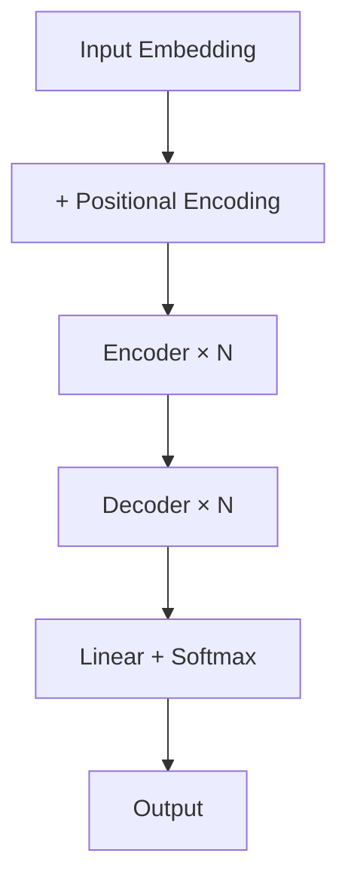

## 从零实现 Mini Transformer

把前面学的所有组件组合起来，实现一个可以训练的 Transformer。



### 1. 位置编码

```python
import torch
import torch.nn as nn
import math

class PositionalEncoding(nn.Module):
    def __init__(self, d_model, max_len=5000):
        super().__init__()
        pe = torch.zeros(max_len, d_model)
        position = torch.arange(0, max_len).unsqueeze(1).float()
        div_term = torch.exp(
            torch.arange(0, d_model, 2).float() * (-math.log(10000.0) / d_model)
        )
        pe[:, 0::2] = torch.sin(position * div_term)
        pe[:, 1::2] = torch.cos(position * div_term)
        self.register_buffer('pe', pe.unsqueeze(0))

    def forward(self, x):
        return x + self.pe[:, :x.size(1)]
```

### 2. Multi-Head Attention

```python
class MultiHeadAttention(nn.Module):
    def __init__(self, d_model, n_heads):
        super().__init__()
        assert d_model % n_heads == 0
        self.d_k = d_model // n_heads
        self.n_heads = n_heads

        self.W_q = nn.Linear(d_model, d_model)
        self.W_k = nn.Linear(d_model, d_model)
        self.W_v = nn.Linear(d_model, d_model)
        self.W_o = nn.Linear(d_model, d_model)

    def forward(self, q, k, v, mask=None):
        B = q.size(0)

        Q = self.W_q(q).view(B, -1, self.n_heads, self.d_k).transpose(1, 2)
        K = self.W_k(k).view(B, -1, self.n_heads, self.d_k).transpose(1, 2)
        V = self.W_v(v).view(B, -1, self.n_heads, self.d_k).transpose(1, 2)

        scores = (Q @ K.transpose(-2, -1)) / math.sqrt(self.d_k)
        if mask is not None:
            scores = scores.masked_fill(mask == 0, -1e9)

        attn = torch.softmax(scores, dim=-1)
        out = (attn @ V).transpose(1, 2).contiguous().view(B, -1, self.d_model)
        return self.W_o(out)
```

### 3. Feed Forward

```python
class FeedForward(nn.Module):
    def __init__(self, d_model, d_ff=2048):
        super().__init__()
        self.net = nn.Sequential(
            nn.Linear(d_model, d_ff),
            nn.ReLU(),
            nn.Linear(d_ff, d_model),
        )

    def forward(self, x):
        return self.net(x)
```

### 4. Encoder 层

```python
class EncoderLayer(nn.Module):
    def __init__(self, d_model, n_heads, d_ff):
        super().__init__()
        self.self_attn = MultiHeadAttention(d_model, n_heads)
        self.ff = FeedForward(d_model, d_ff)
        self.norm1 = nn.LayerNorm(d_model)
        self.norm2 = nn.LayerNorm(d_model)

    def forward(self, x, mask=None):
        # Self-Attention + Add & Norm
        x = self.norm1(x + self.self_attn(x, x, x, mask))
        # Feed Forward + Add & Norm
        x = self.norm2(x + self.ff(x))
        return x
```

### 5. Decoder 层

```python
class DecoderLayer(nn.Module):
    def __init__(self, d_model, n_heads, d_ff):
        super().__init__()
        self.self_attn = MultiHeadAttention(d_model, n_heads)
        self.cross_attn = MultiHeadAttention(d_model, n_heads)
        self.ff = FeedForward(d_model, d_ff)
        self.norm1 = nn.LayerNorm(d_model)
        self.norm2 = nn.LayerNorm(d_model)
        self.norm3 = nn.LayerNorm(d_model)

    def forward(self, x, enc_out, src_mask=None, tgt_mask=None):
        x = self.norm1(x + self.self_attn(x, x, x, tgt_mask))       # Masked
        x = self.norm2(x + self.cross_attn(x, enc_out, enc_out))     # Cross
        x = self.norm3(x + self.ff(x))
        return x
```

### 6. 完整 Transformer

```python
class Transformer(nn.Module):
    def __init__(self, src_vocab, tgt_vocab, d_model=512,
                 n_heads=8, d_ff=2048, n_layers=6):
        super().__init__()
        self.encoder_embed = nn.Embedding(src_vocab, d_model)
        self.decoder_embed = nn.Embedding(tgt_vocab, d_model)
        self.pos_encoding = PositionalEncoding(d_model)

        self.encoder = nn.ModuleList([
            EncoderLayer(d_model, n_heads, d_ff) for _ in range(n_layers)
        ])
        self.decoder = nn.ModuleList([
            DecoderLayer(d_model, n_heads, d_ff) for _ in range(n_layers)
        ])

        self.out = nn.Linear(d_model, tgt_vocab)

    def encode(self, src, src_mask=None):
        x = self.pos_encoding(self.encoder_embed(src))
        for layer in self.encoder:
            x = layer(x, src_mask)
        return x

    def decode(self, tgt, enc_out, src_mask=None, tgt_mask=None):
        x = self.pos_encoding(self.decoder_embed(tgt))
        for layer in self.decoder:
            x = layer(x, enc_out, src_mask, tgt_mask)
        return self.out(x)

    def forward(self, src, tgt, src_mask=None, tgt_mask=None):
        enc_out = self.encode(src, src_mask)
        return self.decode(tgt, enc_out, src_mask, tgt_mask)


# 创建一个小型 Transformer 测试
src_vocab, tgt_vocab = 1000, 1000
model = Transformer(src_vocab, tgt_vocab, d_model=256, n_heads=4, n_layers=3)

src = torch.randint(0, src_vocab, (2, 20))  # batch=2, seq=20
tgt = torch.randint(0, tgt_vocab, (2, 15))  # batch=2, seq=15

output = model(src, tgt)
print(f"输出形状: {output.shape}")  # (2, 15, 1000)
print(f"参数量: {sum(p.numel() for p in model.parameters()):,}")
```

### 训练循环

```python
model.train()
optimizer = torch.optim.AdamW(model.parameters(), lr=1e-4)
criterion = nn.CrossEntropyLoss(ignore_index=0)  # 忽略 padding

for epoch in range(10):
    total_loss = 0
    for src, tgt in dataloader:
        tgt_in = tgt[:, :-1]   # 去掉最后一个 token
        tgt_out = tgt[:, 1:]   # 去掉第一个 token

        # 创建 causal mask
        tgt_mask = torch.tril(torch.ones(tgt_in.size(1), tgt_in.size(1)))
        tgt_mask = tgt_mask.unsqueeze(0).unsqueeze(0)  # (1, 1, L, L)

        optimizer.zero_grad()
        output = model(src, tgt_in, tgt_mask=tgt_mask)
        loss = criterion(output.view(-1, output.size(-1)), tgt_out.reshape(-1))
        loss.backward()
        optimizer.step()
        total_loss += loss.item()

    print(f"Epoch {epoch+1}: loss = {total_loss / len(dataloader):.4f}")
```

### 总结

至此，你已经实现了完整的 Transformer。核心组件：

| 组件 | 作用 |
|------|------|
| PositionalEncoding | 位置信息 |
| MultiHeadAttention | 多头注意力 |
| FeedForward | 非线性变换 |
| LayerNorm + Residual | 稳定训练 |
| Encoder → Decoder | 序列到序列 |

### 相关页面

- [Transformer 架构总览](/tutorials/transformer/01-overview/) — 回顾整体架构
- [大模型原理](/tutorials/llm/) — 从 Transformer 到大模型