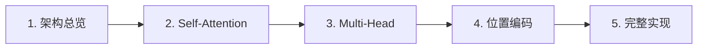

## Transformer 教程

Transformer 是现代大语言模型的基石。从 ChatGPT 到 Claude 到 Llama，所有大模型的底层架构都源自 2017 年的这篇论文。本教程分 5 章，从架构总览到完整实现，学完后你将能**从零实现一个可训练的 Transformer**。

### 你将学到

- 为什么 Transformer 取代了 RNN/LSTM
- Self-Attention 的完整数学推导和 PyTorch 实现
- Multi-Head Attention 如何同时关注多种语义关系
- 正弦编码、可学习编码、RoPE 三种位置编码
- Encoder + Decoder 完整架构的代码实现
- 训练一个真正的 Transformer 模型

### 核心公式

$$
\text{Attention}(Q, K, V) = \text{softmax}\left(\frac{QK^T}{\sqrt{d_k}}\right)V
$$

### 教程目录

1. [Transformer 架构总览](/tutorials/transformer/01-overview/) ✅
2. [Self-Attention 详解](/tutorials/transformer/02-self-attention/) ✅
3. [Multi-Head Attention](/tutorials/transformer/03-multi-head/) ✅
4. [位置编码](/tutorials/transformer/04-positional-encoding/) ✅
5. [从零实现 Mini Transformer](/tutorials/transformer/05-mini-transformer/) ✅