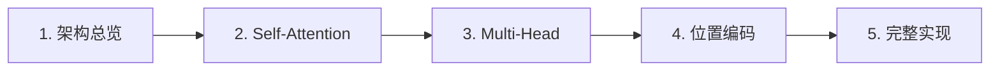

## Transformer 教程

Transformer 是现代大语言模型的基石。本教程分 5 章，从架构总览到完整实现。

### 你将学到

- 注意力机制的数学原理和直观理解
- Self-Attention 与 Cross-Attention 的区别
- Multi-Head Attention 为什么需要多个头
- 位置编码的三种实现方式
- 从零实现一个可以训练的 Transformer

### 核心公式

$$
\text{Attention}(Q, K, V) = \text{softmax}\left(\frac{QK^T}{\sqrt{d_k}}\right)V
$$

### 教程目录

1. [Transformer 架构总览](/tutorials/transformer/01-overview/) ✅
2. [Self-Attention 详解](/tutorials/transformer/02-self-attention/) ✅
3. [Multi-Head Attention](/tutorials/transformer/03-multi-head/) ✅
4. [位置编码](/tutorials/transformer/04-positional-encoding/) ✅
5. [从零实现 Mini Transformer](/tutorials/transformer/05-mini-transformer/) ✅